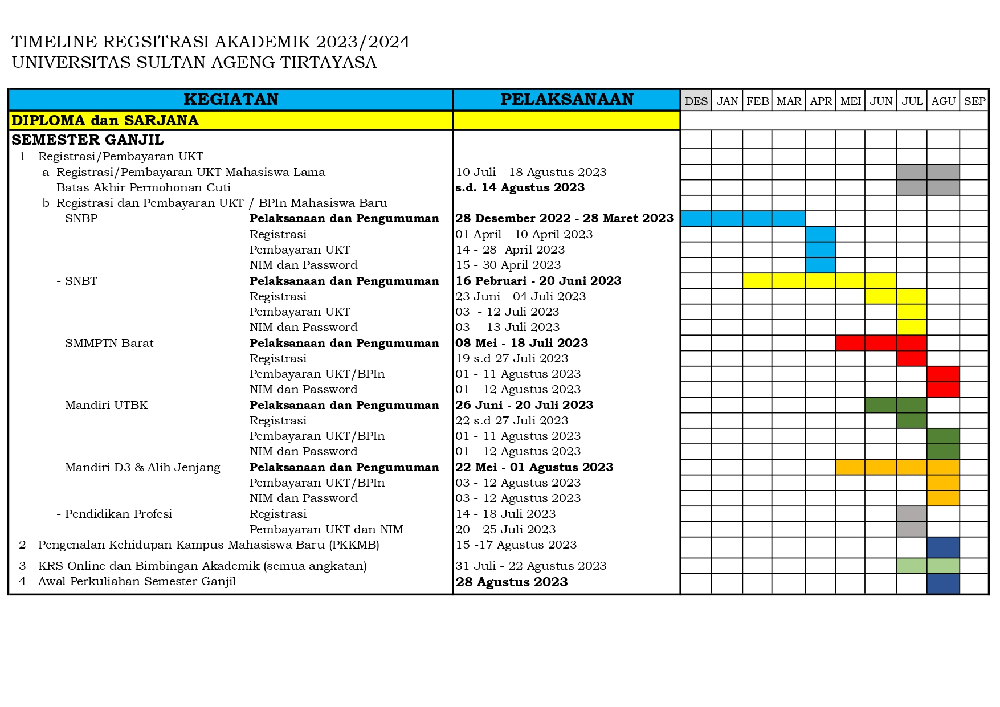
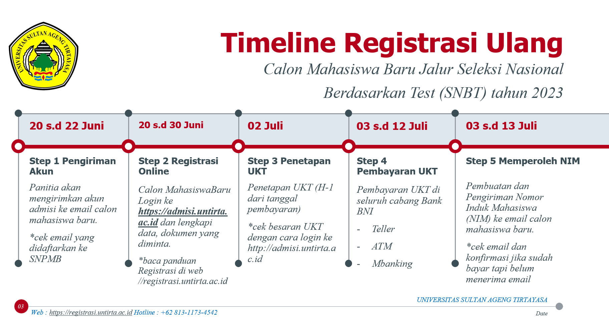

# Penerimaan Mahasiswa Baru

A.) PENERIMAAN MAHASISWA BARU JALUR MANDIRI :

1.  [**PENDAFTARAN PASCASARJANA**](https://registrasi.untirta.ac.id/post/2023-02-09-penerimaan-mahasiswa-baru-pmb-pascasarjana-ta-2023-2024/)
2.  [**PENDAFTARAN DIPLOMA (D3) DAN ALIH JENJANG (S1)**](https://registrasi.untirta.ac.id/post/2023-05-18-pendaftaran-ujian-masuk-mandiri-umm-program-d3-dan-s1-alih-jenjang-tahun-2023/)

B.) PEDOMAN REGISTRASI ULANG SNBP, SNBT, DAN SMMPTN

1.  [**LINK REGISTRASI ULANG ONLINE**](https://registrasi.untirta.ac.id/post/2023-03-03-panduan-registrasi-ulang-snbp-snbt-smmptn-dan-adik-2023/)

Bagi calon mahasiswa baru yang sudah dinyatakan ***lulus tes seleksi*** / ujian masuk perguruan tinggi di Universitas Sultan Ageng Tirtayasa melalui beberapa jalur masuk : Seleksi Nasional Berdasarkan Prestasi (SNBP), Ujian Tulis Berbasis Komputer - Seleksi Nasional Berdasarkan Test (UTBK-SNBT), dan Seleksi Masuk Mandiri Perguruan Tinggi Negeri (SMMPTN) untuk Program Sarjana (S1) dan Diploma (D3). Setelah lulus seleksi bukti lulusnya dituangkan dalam dokumen Surat Keputusan Rektor Universitas Sultan Ageng Tirtayasa tentang hasil seleksi penerimaan mahasiswa baru dari beberapa jalur masuk yang diterbitkan pada tahun akademik berjalan oleh Universitas Sultan Ageng Tirtayasa.

Selanjutnya calon mahasiswa melengkapi persyaratan administrasi akademik dan administrasi keuangan atau sudah membayar Uang Kuliah Tunggal (UKT) dan sudah membayar Sumbangan Pengembangan Instansi (SPI) bagi mahasiswa baru jalur Mandiri. Nomor Induk Mahasiswa (NIM) akan diberikan jika camaba telah menyelesaikan rangkaian proses registrasi ulang.

> **\*\*) [PERMEN NO.194 TAHUN 2019 TENTANG BKT DAN UKT DI UNTIRTA](https://drive.google.com/file/d/1eqmhH4cpcsD9de3W_tepZTlALO71pM7a/view?usp=share_link)**
>
> Hotline Fakultas / Program Studi : <https://untirta.ac.id/kontak/>

## [SLIDE LAYANAN REGISTRASI](https://www.canva.com/design/DAFrHbv2zk8/4dI9nnEa4O8jmddj6ZVziQ/edit)

### KALENDER AKADEMIK :

1.  [Tahun Akademik 2020/2021](https://drive.google.com/file/d/1vvD9VlOBzONSaxPwMba8nN4Yn9xgQKbV/view?usp=sharing)
2.  [Tahun Akademik 2021/2022](https://drive.google.com/file/d/1vyXeqhLnz7JPNPcIErNuFabIRxFdrxON/view?usp=sharing)
3.  [Tahun Akademik 2022/2023](https://drive.google.com/file/d/1tEUuxYIRG-KP2izMFVBx2JybquhkyFNj/view?usp=sharing)
4.  [Tahun Akademik 2023/2024](https://drive.google.com/file/d/11xm-H5oAdp_Zg1IPgIy5Y2TlY49u8S8B/view?usp=sharing)

[Download Panduan e-KTM UNTIRTA](https://drive.google.com/file/d/1c1eCCzoSwOsRZtUxFCYEtWNxcwl2NFKR/view?usp=sharing)
