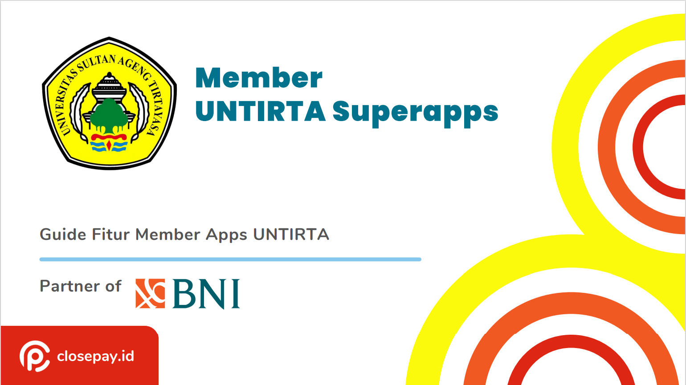
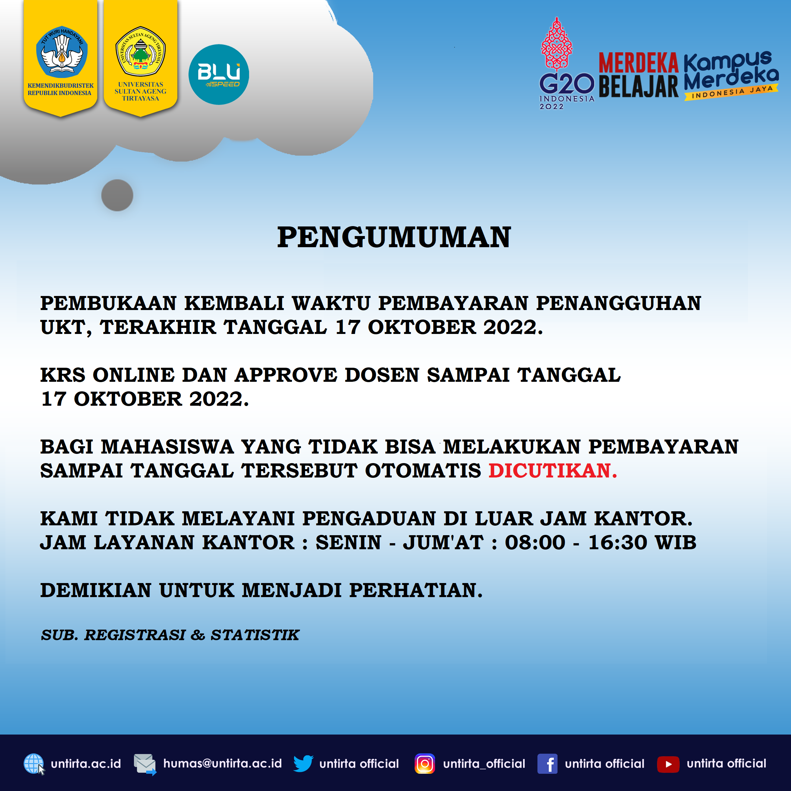

# Penerimaan Mahasiswa Baru

Selamat datang calon mahasiswa baru Universitas Sultan Ageng Tirtayasa (Untirta) jenjang D3, S1, S2, dan S3. Terima kasih atas kepercayaannya untuk memilih Untirta sebagai tempat menuntut ilmu. Tahun ini Untirta menerima mahasiswa baru melalui jalur SNMPTN, SBMPTN, dan SMMPTN untuk **jenjang S1**, jalur UMM untuk **jenjang D3 dan S1 Alih Jenjang**, serta SPMB untuk **jenjang S2 dan S3**.

> Terdapat 2 (dua) jenis seleksi masuk Untirta. **Pertama** adalah seleksi masuk secara Nasional di mana proses seleksi diselenggarakan secara nasional sehingga para pendaftar Untirta tidak harus melaksanakan ujian seleksi di Kampus Untirta (bisa di mana saja). Yang termasuk seleksi masuk secara nasional adalah jalur SNMPTN, SBMPTN, SMMPTN Barat dan ADIK (Afirmasi Dikti).

> **Kedua** adalah seleksi masuk secara lokal yang diselenggarakan oleh Untirta. Pada proses seleksi ini, proses pendaftaran, ujian, hingga pengumuman hasil seleksi diselenggarakan oleh Untirta. Yang termasuk seleksi masuk secara lokal adalah jalur Ujian Masuk Mandiri (UMM) - D3, UMM Pascasarjana (S2 - S3) dan S1 Alih Jenjang (adalah migrasi mahasiswa lulusan D2/D3 ke S1 dari Perguruan Tinggi lain melalui proses administrasi dan konversi nilai mata kuliah yang sudah ditempuh di Perguruan Tinggi asal).

#### **PANDUAN TATA CARA REGISTRASI & PENDAFTARAN MAHASISWA BARU**

Tugas Perguruan Tinggi salah satu diantaranya adalah mencerdaskan kehidupan bangsa seperti yang telah diamanatkan oleh UUD 1945. Untuk itu dibukanya akses yang seluas-luasnya kepada masyarakat untuk masuk ke Perguruan Tinggi adalah bagian penting dari tujuan mulia tersebut.

Seiring berjalannya waktu menghadapi tahun Akademik Ajaran Baru Universitas Sultan Ageng Tirtayasa kembali melaksanakan penerimaan mahasiswa baru yang dibagi kedalam 5 (lima) jalur penerimaan, berikut link panduan tata cara registrasi ulang dan pendaftaran mahasiswa baru :

> 1.  [SNMPTN](/post/2022-03-10-panduan-registrasi-ulang-snmptn-sbmptn-dan-smmptn/) (Seleksi Nasional Masuk Perguruan Tinggi Negeri)
>
> 2.  [UTBK-SBMPTN](/post/2022-03-10-panduan-registrasi-ulang-snmptn-sbmptn-dan-smmptn/) (Ujian Tulis Berbasis Komputer - Seleksi Bersama Masuk Perguruan Tinggi Negeri)
>
> 3.  [SMMPTN BARAT](/post/2022-03-10-panduan-registrasi-ulang-snmptn-sbmptn-dan-smmptn/) (Seleksi Mandiri Masuk Perguruan Tinggi Negeri Wilayah Barat)
>
> 4.  [ADIK (Afirmasi Dikti)](/post/2022-03-10-panduan-registrasi-ulang-snmptn-sbmptn-dan-smmptn/)
>
> 5.  UMM (Ujian Masuk Mandiri)
>
>     a\. [UMM D3 & ALIH JENJANG](/post/2022-01-12-panduan-umm/)
>
>     b\. [UMM S2 & S3](/post/2022-01-21-penerimaan-mahasiswa-baru-pmb-pascasarjana-ta-2022-2023/)
>
>     c\. [UMM JALUR PRESTASI](/post/2022-06-14-panduan-pmb-seleksi-mandiri-jalur-prestasi-tahun-2022/)

> #### Cek Layanan Hotline Fakultas / Program Studi : <https://untirta.ac.id/kontak/>

### Kalender Akademik :

1.  [Tahun Akademik 2020/2021](https://drive.google.com/file/d/1vvD9VlOBzONSaxPwMba8nN4Yn9xgQKbV/view?usp=sharing)
2.  [Tahun Akademik 2021/2022](https://drive.google.com/file/d/1vyXeqhLnz7JPNPcIErNuFabIRxFdrxON/view?usp=sharing)
3.  [Tahun Akademik 2022/2023](https://drive.google.com/file/d/1tEUuxYIRG-KP2izMFVBx2JybquhkyFNj/view?usp=sharing)

[Download Panduan e-KTM UNTIRTA](https://drive.google.com/file/d/1c1eCCzoSwOsRZtUxFCYEtWNxcwl2NFKR/view?usp=sharing)

