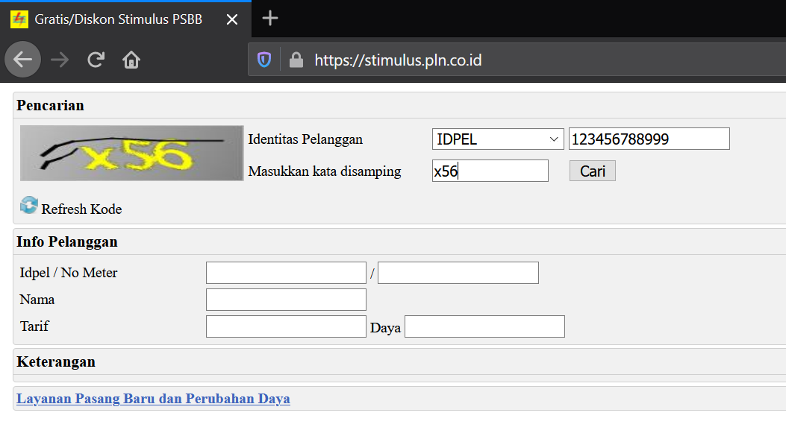

Calon Mahasiswa Baru yang sudah **dinyatakan** **Lulus lewat** jalur Seleksi Nasional Masuk Perguruan Tinggi Negeri **(SNMPTN),** Seleksi Bersama Masuk Perguruan Tinggi (**SBMPTN**), Seleksi Mandiri Masuk Perguruan Tinggi Negeri Barat (**SMMPTN**), yang ditetapkan dengan SK Rektor Universitas Sultan Ageng Tirtayasa agar **mempersiapkan dan wajib melakukan kegiatan sebagai berikut**:

1.  Jadwal registrasi ulang\*

    | NO  | SELEKSI | REGISTRASI ULANG         | PEMBAYARAN UKT            |
    |:----|:--------|:-------------------------|:--------------------------|
    | 1\. | SNMPTN  | 23 Maret - 06 April 2021 | 12 - 23 April 2021        |
    | 2\. | SBMPTN  | 15 - 25 Juni 2021        | 29 Juni - 09 Juli 2021    |
    | 3\. | SMMPTN  | 17 - 28 Juli 2021        | 29 Juli - 06 Agustus 2021 |

    ***\*) Jika ada perubahan jadwal akan kami informasikan melalui email.***

2.  Diagram alur proses registrasi ulang secara *online.*

    

3.  Penjelasan registrasi ulang secara *online* sesuai dengan jadwal dan diagram alur di atas dengan ketentuan sebagai berikut.

    A.  Mempersiapkan dokumen yang harus diunggah (*upload*) dalam bentuk **pdf** atau **jpg** (**ukuran file tidak melebihi 250 KB**).

        1.  [**Pakta Integritas Uang Kuliah Tunggal**](https://drive.google.com/file/d/1HyFx0AQQZaZOhc3tI8n2i71dn4yArUAG/view?usp=sharing) (download, isi, cetak, *scan*).

        2.  [**Surat Pernyataan Mentaati Peraturan**](https://drive.google.com/file/d/1I0Z1IlYzoADB6NDzP_KfvTTWuJXsZ3Qu/view?usp=sharing){target="_blank"} (download, isi, cetak, *scan*).

        3.  Ijazah bagi lulusan 3 tahun terakhir : 2019, 2020, dan 2021 / Surat Keterangan Lulus (SKL) bagi lulusan tahun 2021 yang belum memperoleh Ijazah.

        4.  Kartu Peserta Tes.

        5.  Akta Kelahiran.

        6.  Kartu Keluarga.

        7.  Bukti pembayaran listrik bagi pelanggang *pascabayar* **atau** bukti pembelian token listrik bagi pelanggan *prabayar*.

            Bagi pelanggan listrik 450VA yang digratiskan dan tidak memiliki bukti pembayaran bisa membuatnya di halaman [**https://stimulus.pln.co.id/**](https://stimulus.pln.co.id/){.uri} seperti pada gambar berikut.

            

        8.  SPPT Pajak Bumi dan Bangunan (PBB) tiga tahun terakhir (pilih salah satu) **atau** [**Surat Pernyataan tentang Luas Tanah dan Bangunan Rumah yang ditempati bagi yang tidak punya SPPT**](https://drive.google.com/file/d/1HxczESstO4LjNTLd5_oQNXy0FQPAG96-/view?usp=sharing){target="_blank"} (download, isi, cetak, *scan*).

        9.  Surat Keterangan Kesehatan dan Tes Narkoba untuk **semua Program Studi** dan Surat Pemeriksaan Buta Warna untuk Program Studi berikut (*scan*, **jadikan 1 file**, dan *upload*)

            | No.  | Program Studi                            | Keterangan                              |
            |:-----|:-----------------------------------------|:----------------------------------------|
            | 1\.  | Pendidikan Non Formal                    | Tidak Boleh Buta Warna                  |
            | 2\.  | Pendidikan Bahasa Indonesia              | Tidak Boleh Buta Warna                  |
            | 3\.  | Pendidikan Bahasa Inggris                | Tidak Boleh Buta Warna                  |
            | 4\.  | Pendidikan Biologi                       | Tidak Boleh Buta Warna                  |
            | 5\.  | Pendidikan Matematika                    | Tidak Boleh Buta Warna                  |
            | 6\.  | Pendidikan Guru Sekolah Dasar            | Tidak Boleh Buta Warna                  |
            | 7\.  | PGPAUD                                   | Tidak Boleh Buta Warna                  |
            | 8\.  | Pendidikan Fisika                        | Tidak Boleh Buta Warna                  |
            | 9\.  | Pendidikan IPA                           | Tidak Boleh Buta Warna                  |
            | 10\. | Pendidikan Kimia                         | Tidak Boleh Buta Warna                  |
            | 11\. | Pendidikan Vokasional Teknik Mesin       | Tidak Boleh Buta Warna                  |
            | 12\. | Pendidikan Vokasional Teknik Elektro     | Tidak Boleh Buta Warna                  |
            | 13\. | Bimbingan dan Konseling                  | Tidak Boleh Buta Warna                  |
            | 14\. | Pendidikan Pancasila dan Kewarganegaraan | Tidak Boleh Buta Warna                  |
            | 15\. | Pendidikan Sejarah                       | Tidak Boleh Buta Warna                  |
            | 16\. | Pendidikan Seni Pertunjukan              | Tidak Boleh Buta Warna                  |
            | 17\. | Pendidikan Sosiologi                     | Tidak Boleh Buta Warna                  |
            | 18\. | Teknik Mesin                             | Tidak Boleh Buta Warna                  |
            | 19\. | Teknik Elektro                           | Tidak Boleh Buta Warna                  |
            | 20\. | Teknik Industri                          | Buta Warna Sebagian/Partial masih boleh |
            | 21\. | Teknik Metalurgi                         | Tidak Boleh Buta Warna                  |
            | 22\. | Teknik Kimia                             | Tidak Boleh Buta Warna                  |
            | 23\. | Teknik Sipil                             | Tidak Boleh Buta Warna                  |
            | 24\. | Informatika                              | Tidak Boleh Buta Warna                  |
            | 25\. | Kedokteran                               | Tidak Boleh Buta Warna                  |
            | 26\. | Gizi                                     | Tidak Boleh Buta Warna                  |
            | 27\. | Ilmu Keolahragaan                        | Tidak Boleh Buta Warna                  |
            | 28\. | Keperawatan (D3 & S1)                    | Tidak Boleh Buta Warna                  |

        10. Bukti Penghasilan Ayah atau diisi dengan penghasilan Wali yang membiayai Kuliah dengan ketentuan sebagai berikut.

            -   **PNS**/**TNI**/**BUMN**/**Karyawan Swasta**: Slip Gaji / Bukti Penghasilan (maksimal dua bulan terakhir),
            -   **Wiraswasta**/**Petani**/**Pedagang**/**Buruh**/**Tidak Mempunyai Pekerjaan Tetap** : Surat Keterangan Penghasilan dari Kelurahan dengan mencantumkan nama Pekerjaan dan Nominal Penghasilannya
            -   **Pensiunan** : Rekening Koran atau *print out* Buku Rekening Pensiun (max dua bulan terakhir).

        11. Bukti Penghasilan Ibu atau diisi dengan penghasilan Wali yang membiayai Kuliah dengan ketentuan sebagai berikut.

            -   **PNS**/**TNI**/**BUMN**/**Karyawan Swasta**: Slip Gaji / Bukti Penghasilan (maksimal dua bulan terakhir),

            -   **Wiraswasta**/**Petani**/**Pedagang**/**Buruh**/**Tidak Mempunyai Pekerjaan Tetap** : Surat Keterangan Penghasilan dari Kelurahan dengan mencantumkan nama Pekerjaan dan Nominal Penghasilannya

            -   **Pensiunan** : Rekening Koran atau *print out* Buku Rekening Pensiun (max dua bulan terakhir).

                > ***Kolom Penghasilan Ayah dan Ibu tidak boleh Nol dua-duanya. Jika memang Nol dua-duanya maka masukan Slip/penghasilan dari penanggung jawab biaya kuliah.***

        12. Foto diri berukuran 4×6 dengan format JPG sesuai dengan ketentuan berikut.

            -   Laki-laki: jas hitam, baju putih, dasi hitam, *background* merah,
            -   Perempuan: jas hitam/blazer, baju putih, dasi hitam, *background* merah,
            -   Perempuan berjilbab: jilbab warna putih, *background* merah, jas hitam/blazer tanpa dasi.

        13. **Berkas tambahan bagi pendaftar KIP-Kuliah**

            -   Bukti registrasi KIP-Kuliah,
            -   Peta rute menuju rumah dari kota terdekat,
            -   Foto rumah tampak depan, tampak samping, dan tampak belakang (**jadikan 1 file**).

    B.  Menunggu *Username* dan *Password* untuk melakukan Registrasi ulang secara *online* yang akan dikirim ke alamat email yang digunakan saat mendaftar SNMPTN. *Username* dan *Password* akan dikirim mulai tanggal **22 -- 24 Maret 2021**.

        > Cek juga folder SPAM di email anda, karena mungkin email kami masuk ke folder SPAM anda**.**

    C.  Melakukan Registrasi ulang secara *online* dari tanggal **25 Maret - 06 April 2021** di [**http://admisi.untirta.ac.id**](http://admisi.untirta.ac.id){.uri} setelah menerima email *Username* dan *Password*. Pastikan semua data yang diisi dan berkas yang diunggah harus lengkap terlebih dahulu.

        > Isilah dengan **BENAR**, **AKURAT**, dan **JUJUR** semua data diri anda. Kesalahan dalam mengisi data dan memahami panduan registrasi menjadi tanggung jawab calon mahasiswa baru.

    D.  Menerima nominal UKT akan dikirim melalui email masing masing calon mahasiswa setelah menyelesaikan proses **A** hingga **C**.

        > **Cek juga folder SPAM di email anda, karena mungkin email kami masuk ke folder SPAM anda.**

    E.  Pembayaran Uang Kuliah Tunggal (UKT) di Bank BNI seluruh Cabang Indonesia melalui *Teller* atau ATM dengan menggunakan menu *Student* *Payment* *Center* (SPC) kode untirta 8041, dengan ketentuan sebagai berikut.

        -   Waktu: **12 s/d 23 April 2021**.
        -   Melakukan pembayaran Uang Kuliah Tunggal (UKT) dengan menyebut No Peserta SNMPTN.
        -   Menerima bukti pembayaran dari Bank BNI (Teller atau ATM).
        -   Tata cara pembayaran UKT bisa diakses [**di sini**](https://bit.ly/tirtaUKT).
        -   Khusus untuk Program Studi Kedokteran, UKT sebesar Rp15.000.000,00 s.d. Rp22.000.000,00 (UKT Kelompok III s.d. VIII)

    F.  Menerima Nomor Induk Mahasiswa (NIM) dan *Password* SIAKAD akan dikirim melalui email masing-masing.

        -   **Pendaftar Non KIP-K**: setelah melakukan pembayaran UKT
        -   **Pendaftar KIP-K**: setelah dinyatakan sebagai penerima KIP-K

4.  **Lain-lain**:

    A.  Setiap calon mahasiswa yang **tidak dapat memenuhi ketentuan pengumuman ini dinyatakan mengundurkan diri** sebagai calon mahasiswa Universitas Sultan Ageng Tirtayasa.

    B.  Jika ada pengumuman atau perubahan jadwal akan diberitahukan kemudian melalui

        1.  <https://admisi.untirta.ac.id>,
        2.  <https://untirta.ac.id>,
        3.  email anda masing-masing (**pastikan email anda aktif**).

    C.  Hal yang belum jelas bisa ditanyakan melalui email [**registrasi\@untirta.ac.id**](mailto:registrasi@untirta.ac.id){.email}. atau [**Hotline Registrasi : 0813-1173-4542**](http://wa.me/6281311734542)
