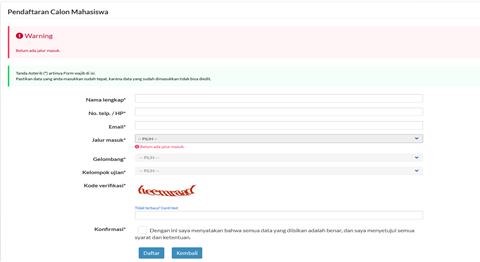

```{=html}
<p align="center"><strong>
PEDOMAN UMUM <br>
SELEKSI MANDIRI JALUR PRESTASI AKADEMIK DAN NON AKADEMIK <br>
UNIVERSITAS SULTAN AGENG TIRTAYASA <br>
TAHUN AKADEMIK 2022/2023
</strong></p>
```


#### PENGANTAR

Seleksi Mandiri Jalur Akademik dan Non Akademik Untirta adalah seleksi
penerimaan mahasiswa baru Universitas Sultan Ageng Tirtayasa yang
diperuntukkan bagi siswa yang mempunyai prestasi akademik lulusan
SMA/MA/SMK atau sederajat paling lama 3 (tiga) tahun terakhir, untuk
memilih jurusan yang sesuai dengan kompetensi yang dimiliki. Calon
mahasiswa tersebut diharapkan mampu melanjutkan prestasi yang dimiliki
dengan pembinaan dari bidang kemahasiswaan Untirta sehingga dapat
memperkuat Untirta dalam bidang prestasi mahasiswa.

#### RANGKAIAN SELEKSI

1.  Pendaftaran (**01 -- 13 Juli 2022**)
    -   **Biaya Pendaftaran Rp. 350.000,-**
2.  Seleksi Berkas (Portofolio)  (**14 Juli 2022**)
    1.  Test UTBK (**15 Juli 2022 pukul 08:00 - 10:00 WIB**)

        +--------------------------+-----------------+----------------------------------+
        | Tanggal / Lokasi         | Waktu           | Keterangan                       |
        +==========================+=================+==================================+
        | 15 Juli 2022             | 08:00 - 10:00   | UTBK                             |
        |                          |                 |                                  |
        | Kampus Untirta Pakupatan |                 |                                  |
        +--------------------------+-----------------+----------------------------------+
        |                          | 11:00 - selesai | Wawancara dan Uji Keterampilan : |
        |                          |                 |                                  |
        |                          |                 | Bawa Dokumen Asli                |
        |                          |                 |                                  |
        |                          |                 | Portofolio                       |
        |                          |                 |                                  |
        |                          |                 | Sertifikat Prestasi              |
        +--------------------------+-----------------+----------------------------------+
3.  Pengumuman hasil seleksi (**18 Juli 2022**)<br><br>

**KETENTUAN, PERSYARATAN DAN INFORMASI KHUSUS**

**A. Ketentuan**

1.  Warga Negara Indonesia
2.  Lulusan SMA/MA/SMK atau sederajat paling lama 3 (tiga) tahun
    terakhir yang memiliki prestasi akademik maupun non akademik minimal
    tingkat Nasional yang dibuktikan dengan sertifikat.
3.  Mendaftarkan diri sebagai peserta Seleksi Mandiri Jalur Prestasi

**B. Pesyaratan**

1.  Ijazah SMA/SMK/MA/SMALB atau sederajat dan menyerahkan fotocopi
    ijazah
2.  Memiliki NISN dan NPSN
3.  Memiliki surat rekomendasi dari sekolah asal untuk melanjutkan studi
    ke perguruan tinggi
4.  Mengikuti wawancara (calon mahasiswa) dengan pihak kampus
5.  Memiliki prestasi akademik atau non akademik minimal tingkat
    nasional/ sebagai juara 1,2, atau 3 yang diperoleh selama masa studi
    di SMA/SMK/MA

**A. Informasi Khusus**

1.  Pendaftar dapat memilih 2 (dua) sesuai kelompok SAINTEK dan SOSHUM
    dan memenuhi syarat dari masing-masing program studi.

2.  Program **Studi Kedokteran** dan **Program Studi Keperawatan** tidak
    menerima jalur Prestasi tahun ini.

3.  Untuk **Program Studi Gizi** harus berasal dari SMA/MA **IPA**.

4.  Prestasi Akademik dan Non akademik merupakan kejuaraan yang
    dilaksanakan oleh :

    a\. Pusat Prestasi Nasional

    b\. Lembaga pemerintah

    c\. Lembaga Swadaya Masyarakat

    d\. Perguruan Tinggi

    e\. Kejuaraan Internasional

    f\. Lembaga lainnya yang kredibel

4\. Berikut Kejuaraan yang dapat diakui sebagai jalur masuk prestasi
Untirta :

**a. Kejuaraan yang dilaksanakan** oleh Pusat Prestasi Nasional
Kemendikbud yaitu :

```{=html}
<style type="text/css">
.tg  {border-collapse:collapse;border-spacing:0;}
.tg td{border-color:black;border-style:solid;border-width:1px;font-family:Arial, sans-serif;font-size:14px;
  overflow:hidden;padding:10px 5px;word-break:normal;}
.tg th{border-color:black;border-style:solid;border-width:1px;font-family:Arial, sans-serif;font-size:14px;
  font-weight:normal;overflow:hidden;padding:10px 5px;word-break:normal;}
.tg .tg-0lax{text-align:left;vertical-align:top}
</style>
<table class="tg">
<thead>
  <tr>
    <th class="tg-0lax">No</th>
    <th class="tg-0lax">Nama Kejuaraan/Prestasi</th>
    <th class="tg-0lax">Ketentuan</th>
    <th class="tg-0lax">Program Studi</th>
  </tr>
</thead>
<tbody>
  <tr>
    <td class="tg-0lax">1.</td>
    <td class="tg-0lax">Kompetisi Sains Nasional (KSN) Pusat Prestasi Nasional Kemendikbud  bidang :<br>Matematika<br>Fisika<br>Biologi<br>Kimia<br>Informatika<br>Astronomi<br>Kebumian<br>Geografi</td>
    <td class="tg-0lax">Peraih medali emas, perak, atau perunggu</td>
    <td class="tg-0lax">Semua Program Studi di Untirta kecuali S1 Kedokteran dan S1 Keperawatan.<br>Untuk Program Studi Gizi harus berasal dari SMA/MA IPA</td>
  </tr>
  <tr>
    <td class="tg-0lax">2.</td>
    <td class="tg-0lax">Penelitian Siswa Indonesia (KoPSI) oleh Pusat Prestasi Nasional Kemendikbud</td>
    <td class="tg-0lax">Kompetisi ini bisa p erorangan atau kelompok maksimal 2 orang<br>Peraih medali emas, perak, atau perunggu</td>
    <td class="tg-0lax">Juara Katagori bidang Soshum : semua Prodi soshum<br>Juara Katagori Bidang Saintek : semua Prodi Saintek kecuali S1 Kedokteran dan S1 Keperawatan.<br>Untuk Program Studi Gizi harus berasal dari SMA/MA IPA</td>
  </tr>
  <tr>
    <td class="tg-0lax">3</td>
    <td class="tg-0lax">Festival Inovasi dan wirausahaan Siswa Indonesia (FIKSI) oleh Pusat Prestasi Nasional Kemendikbud<br> </td>
    <td class="tg-0lax">Peraih medali emas, perak, atau perunggu</td>
    <td class="tg-0lax">Juara kategori : Boga; Desain grafis; Fashion; Kriya dapat dapat memilih semua Prodi soshum<br>Juara kategori Budidaya dan lintas usaha dapat memilih program studi Soshum dan sains kategori Aplikasi dan games dapat memilih program semua program studi</td>
  </tr>
  <tr>
    <td class="tg-0lax">4</td>
    <td class="tg-0lax">Kompetisi Olahraga Siswa Nasional (KOSN) oleh Pusat Prestasi Nasional Kemendikbud kategori  : Karate dan Silat;</td>
    <td class="tg-0lax">medali emas, perak, atau perunggu</td>
    <td class="tg-0lax">dapat memilih program studi Olah Raga</td>
  </tr>
  <tr>
    <td class="tg-0lax">5</td>
    <td class="tg-0lax">Festival dan Lomba Seni Siswa Nasional (FLS2N) oleh Pusat Prestasi Nasional Kemendikbud<br> <br> </td>
    <td class="tg-0lax">medali emas, perak, atau perunggu</td>
    <td class="tg-0lax">kategori : Film pendek; Kriya; Komik dapat memilih Ilmu Komunikasi, Seni pertunjukan dan bahasa Indonesia<br>kategori : Baca puisi; Gitar solo; Monolog; Tari kreasi; Vokal solo putra; Vokal solo putri; Desain poster; dapat memilih program studi Seni Pertunjukan , Bahasa Indonesia.</td>
  </tr>
  <tr>
    <td class="tg-0lax">6</td>
    <td class="tg-0lax">Lomba Debat Bahasa Indonesia (LDBI) oleh Pusat Prestasi Nasional Kemendikbud</td>
    <td class="tg-0lax">medali emas, perak, atau perunggu</td>
    <td class="tg-0lax">Dapat memilih program studi ilmu sosial dan humaniora.</td>
  </tr>
  <tr>
    <td class="tg-0lax">7</td>
    <td class="tg-0lax">National Schools Debating Championship (NSDC) oleh Pusat Prestasi Nasional Kemendikbud</td>
    <td class="tg-0lax">medali emas, perak, atau perunggu</td>
    <td class="tg-0lax">Dapat memilih program studi ilmu sosial dan humaniora.</td>
  </tr>
  <tr>
    <td class="tg-0lax">8</td>
    <td class="tg-0lax">Lomba Jurnalistik Siswa Indonesia (LJSI) oleh Pusat Prestasi Nasional Kemendikbud</td>
    <td class="tg-0lax">medali emas, perak, atau perunggu</td>
    <td class="tg-0lax">Dapat memilih program studi ilmu sosial dan humaniora.</td>
  </tr>
  <tr>
    <td class="tg-0lax">9</td>
    <td class="tg-0lax">Lomba Kompetensi Siswa (LKS) oleh Pusat Prestasi Nasional Kemendikbud<br> </td>
    <td class="tg-0lax">Juara 1, 2, 3</td>
    <td class="tg-0lax">kategori :<br>Pemasaran daring;<br>Web technologies;<br>cnc miling;<br>industrial control;<br>menchanical engineering cad;<br>Teknik tekstil;<br>automobile technology;<br>graphic design technology;<br>wall and floor tilling;<br>plumbing and heating;<br>electronics;<br>nautika;<br>teknologi kecerdasan buatan;<br>Teknik pengukuran;<br>cloud computing;<br>restaurant service;<br>Cyber security;<br>mechatronics;<br>pengolahan pangan;<br>Teknik distribusi telekomunikasi;<br>industry pariwisata;<br> system keamanan perusahaan;<br>Teknik perancangan model 3 dimensi;<br>Teknik perawatan dan perbaikan sepeda motor;<br>print media teknologi;<br>electrical installation;<br>cabinetmaking;<br>plastic die engineering;<br>health and social care;<br>mobile robotics;<br>landscape and gardening;<br>refrigeration and air conditioning;<br>it network system administration;<br>fashion technology;<br>welding; it software solution for business;<br>teknologi peternakan;<br>farmasi;<br>cooking;<br>*dapat bebas memilih program studi.<br>kategori : Seni lukis; hotel receptions; hairdressing; dapat bebas memilih program studi ilmu sosial dan humaniora</td>
  </tr>
</tbody>
</table>
```
**b. Kejuaraan Internasional**

```{=html}
<style type="text/css">
.tg  {border-collapse:collapse;border-spacing:0;}
.tg td{border-color:black;border-style:solid;border-width:1px;font-family:Arial, sans-serif;font-size:14px;
  overflow:hidden;padding:10px 5px;word-break:normal;}
.tg th{border-color:black;border-style:solid;border-width:1px;font-family:Arial, sans-serif;font-size:14px;
  font-weight:normal;overflow:hidden;padding:10px 5px;word-break:normal;}
.tg .tg-0lax{text-align:left;vertical-align:top}
</style>
<table class="tg">
<thead>
  <tr>
    <th class="tg-0lax">No</th>
    <th class="tg-0lax">Nama Kejuaraan/Prestasi</th>
    <th class="tg-0lax">Ketentuan</th>
    <th class="tg-0lax">Program Studi</th>
  </tr>
</thead>
<tbody>
  <tr>
    <td class="tg-0lax">1</td>
    <td class="tg-0lax">Worldskills Competition<br> </td>
    <td class="tg-0lax">memiliki medali emas, perak, atau perunggu</td>
    <td class="tg-0lax">Kategori :<br>Web Design,<br>Electrical<br>Installation, - IT Network System<br>Administration, - IT Software Solution for Business, - Fashion Technology, - Refrigeration and Air<br>Conditioning, - Welding, - Automobile Technology - Electronics<br>*dapat memilih semua Program studi</td>
  </tr>
  <tr>
    <td class="tg-0lax">2</td>
    <td class="tg-0lax">International Science Olympiads</td>
    <td class="tg-0lax">memiliki medali emas, perak, atau perunggu</td>
    <td class="tg-0lax">dapat memilih semua program studi</td>
  </tr>
  <tr>
    <td class="tg-0lax">3</td>
    <td class="tg-0lax">International Mathematical Olympiad</td>
    <td class="tg-0lax">memiliki medali emas, perak, atau perunggu</td>
    <td class="tg-0lax">dapat memilih semua program studi</td>
  </tr>
  <tr>
    <td class="tg-0lax">4</td>
    <td class="tg-0lax">International Physics Olympiad (IPhO)</td>
    <td class="tg-0lax">memiliki medali emas, perak, atau perunggu</td>
    <td class="tg-0lax">dapat memilih semua program studi</td>
  </tr>
  <tr>
    <td class="tg-0lax">5</td>
    <td class="tg-0lax">International Chemistry Olympiad (IChO)</td>
    <td class="tg-0lax">memiliki medali emas, perak, atau perunggu</td>
    <td class="tg-0lax">dapat memilih semua program studi</td>
  </tr>
  <tr>
    <td class="tg-0lax">6</td>
    <td class="tg-0lax">International Olympiad in Informatics (IOI)</td>
    <td class="tg-0lax">memiliki medali emas, perak, atau perunggu</td>
    <td class="tg-0lax">dapat memilih semua program studi</td>
  </tr>
  <tr>
    <td class="tg-0lax">7</td>
    <td class="tg-0lax">International Biology Olympiad (IBO)</td>
    <td class="tg-0lax">memiliki medali emas, perak, atau perunggu</td>
    <td class="tg-0lax">dapat memilih semua program studi</td>
  </tr>
  <tr>
    <td class="tg-0lax">8</td>
    <td class="tg-0lax">International Astronomy Olympiad (IAO)</td>
    <td class="tg-0lax">memiliki medali emas, perak, atau perunggu</td>
    <td class="tg-0lax">dapat memilih semua program studi</td>
  </tr>
  <tr>
    <td class="tg-0lax">9</td>
    <td class="tg-0lax">International Junior Science Olympiad</td>
    <td class="tg-0lax">memiliki medali emas, perak, atau perunggu</td>
    <td class="tg-0lax">dapat memilih semua program studi</td>
  </tr>
  <tr>
    <td class="tg-0lax">10</td>
    <td class="tg-0lax">International Earth Science Olympiad</td>
    <td class="tg-0lax">memiliki medali emas, perak, atau perunggu</td>
    <td class="tg-0lax">dapat memilih semua program studi</td>
  </tr>
  <tr>
    <td class="tg-0lax">11</td>
    <td class="tg-0lax">International Geography Olympiad (iGeo)</td>
    <td class="tg-0lax">memiliki medali emas, perak, atau perunggu</td>
    <td class="tg-0lax">dapat memilih program studi ilmu sosial dan humaniora</td>
  </tr>
  <tr>
    <td class="tg-0lax">13</td>
    <td class="tg-0lax">International Linguistics Olympiad (IOL)</td>
    <td class="tg-0lax">memiliki medali emas, perak, atau perunggu</td>
    <td class="tg-0lax">dapat memilih program studi ilmu sosial dan humaniora</td>
  </tr>
  <tr>
    <td class="tg-0lax">14</td>
    <td class="tg-0lax">International Philosophy Olympiad (IPO)</td>
    <td class="tg-0lax">memiliki medali emas, perak, atau perunggu</td>
    <td class="tg-0lax">dapat memilih program studi ilmu sosial dan humaniora</td>
  </tr>
  <tr>
    <td class="tg-0lax">15</td>
    <td class="tg-0lax">International Olympiad on Astronomy and Astrophysics (IOAA)</td>
    <td class="tg-0lax">memiliki medali emas, perak, atau perunggu</td>
    <td class="tg-0lax">dapat memilih program studi ilmu sosial dan humaniora</td>
  </tr>
  <tr>
    <td class="tg-0lax">16</td>
    <td class="tg-0lax">International Economics Olympiad</td>
    <td class="tg-0lax">memiliki medali emas, perak, atau perunggu</td>
    <td class="tg-0lax">dapat memilih program studi ilmu sosial dan humaniora</td>
  </tr>
  <tr>
    <td class="tg-0lax">17</td>
    <td class="tg-0lax">Kejuaraan Internasional Lainnya</td>
    <td class="tg-0lax">memiliki medali emas, perak, atau perunggu</td>
    <td class="tg-0lax">Dapat memilih sesuai bidang ilmunya</td>
  </tr>
</tbody>
</table>
```
**c. Kejuaraan olah raga** yang dilaksanakan pada tingkat minimal
nasioanal dengan cabang oleh raga **dapat memilih Prodi Ilmu
Keolahragaan** :

+----------------------+---------------------------------+
| 1.  Atletik          | 11) Futsal                      |
| 2.  Renang           | 12) Pencak silat                |
| 3.  Bulutangkis      | 13) Taekwondo                   |
| 4.  Tenis lapangan   | 14) Judo                        |
| 5.  Tenis meja       | 15) Karate                      |
| 6.  Sepak takraw     | 16) Hockey                      |
| 7.  Sepak bola       | 17) Pentaque                    |
| 8.  Bola voli        | 18) Kriket                      |
| 9.  Bola voli pantai | 19) Anggar                      |
| 10. Basket           | 20) Dan Cabang olahraga lainnya |
+----------------------+---------------------------------+

**d.** **Prestasi bidang Keagamaan** yang dilaksanakan pada tingkat
minimal nasional dengan hafidz quran minimal 5 juz, dapat memilih
program studi Soshum dan FKIP

**e. Kejuaraan lainnya yang diselenggarakan oleh Lembaga kredibel pada
tingkat nasional**

**KUOTA MAHASISWA**

Kuota yang akan diterima melalui penenerimaan mahasiswa baru jalur
mandiri prestasi khusus paling banyak 50 Orang.<br><br>

### 

**ALUR PENDAFTARAN DAN REGISTRASI JALUR PRESTASI**

{width="1000"}

#### TATA CARA PENDAFTARAN

1.  Buka laman
    [**https://admisi.untirta.ac.id**](https://admisi.untirta.ac.id)**,
    Klik Daftar** pada tanda yang ditunjuk panah merah.

    

2.  Masukan data yang diminta dan pilihan program studi yang diinginkan.
    Pastikan data diisi dengan benar (no.HP/email) karena semua data
    akan mejadi acuan panitia dalam berkomunikasi atu mengirim
    notifikasi. Satu email hanya bisa dipakai untuk mendaftar satu kali.
     

3.  Setelah memasukan kode verifikasi dan ceklis konfirmasi kemudian
    klik **Daftar**.

    

    > *Peserta dapat memilih maksimal **dua program studi**.*

4.  **Cetak Bukti Pendaftaran** dan tunjukan ke petugas Teler Bank
    (**BNI**) untuk melakukan pembayaran sebesar **Rp350.000**, atau
    bisa melakukan pembayaran dengan salah satu fasilitas Bank cek [**di
    sini**](https://drive.google.com/file/d/1IIaFh62Irl6cK4EpdaTqcwOk3OMfmH8t/view?usp=sharing)

    contoh :

    {width="300"}

    > **Nomor Pendaftaran** = Nomor Rekening/Nomor Tagihan.
    >
    > Pembayaran pendaftaran dilakukan untuk mengaktifkan Nomor
    > Pendaftaran (token) dan Password. Untuk Selanjutnya bisa digunakan
    > untuk **Login** ke
    > [**https://admisi.untirta.ac.id**](https://admisi.untirta.ac.id/)
    > dan melengkapi data.

5.  Setelah melakukan pembayaran, buka kembali laman
    [**https://admisi.untirta.ac.id**](https://admisi.untirta.ac.id)
    kemudian pendaftar melakukan **Login,** dengan menggunakan Nomor
    Pendaftaran dan Password yang ada pada Bukti Pendaftaran.

6.  **Lengkapi Data dengan Benar dan Jujur,** berikut dokumen yang harus
    dilengkapi :

    1.  File Pasfoto berwarna terbaru (standar untuk ijazah) dengan
        wajah menghadap ke depan, ukuran 4x6 cm, **berformat \*jpg**,
        dengan resolusi maksimum 300pxl x 450pxl, dan ukuran file
        maksimum 200 kb.

        1.  Pakta Integritas Uang Kuliah Tunggal dan IPIN, [**Jalur
            Prestasi**](https://drive.google.com/file/d/1aEAVe-tMrYD8RfLY425-eeBXLLTe493Z/view?usp=sharing)
            (*download*, isi, *scan*, dan *upload*).

            ```{=html}
            <style type="text/css">
            .tg  {border-collapse:collapse;border-spacing:0;}
            .tg td{border-color:black;border-style:solid;border-width:1px;font-family:Arial, sans-serif;font-size:14px;
              overflow:hidden;padding:10px 5px;word-break:normal;}
            .tg th{border-color:black;border-style:solid;border-width:1px;font-family:Arial, sans-serif;font-size:14px;
              font-weight:normal;overflow:hidden;padding:10px 5px;word-break:normal;}
            .tg .tg-0lax{text-align:left;vertical-align:top}
            </style>
            <table class="tg">
            <thead>
              <tr>
                <th class="tg-0lax">NO.</th>
                <th class="tg-0lax">PROGRAM STUDI</th>
                <th class="tg-0lax">Kelompok</th>
                <th class="tg-0lax">IPIN (Iuran Pengembangan Institusi)</th>
              </tr>
            </thead>
            <tbody>
              <tr>
                <td class="tg-0lax">1.</td>
                <td class="tg-0lax">Hukum</td>
                <td class="tg-0lax">SOSHUM</td>
                <td class="tg-0lax">15 juta</td>
              </tr>
              <tr>
                <td class="tg-0lax">2.</td>
                <td class="tg-0lax">Bimbingan dan Konseling</td>
                <td class="tg-0lax">SOSHUM</td>
                <td class="tg-0lax">15 Juta</td>
              </tr>
              <tr>
                <td class="tg-0lax">3.</td>
                <td class="tg-0lax">Pendidikan Bahasa Inggris</td>
                <td class="tg-0lax">SOSHUM</td>
                <td class="tg-0lax">15 Juta</td>
              </tr>
              <tr>
                <td class="tg-0lax">4.</td>
                <td class="tg-0lax">Pendidikan Bahasa Indonesia</td>
                <td class="tg-0lax">SOSHUM</td>
                <td class="tg-0lax">15 Juta</td>
              </tr>
              <tr>
                <td class="tg-0lax">5.</td>
                <td class="tg-0lax">Pendidikan Biologi</td>
                <td class="tg-0lax">SAINTEK</td>
                <td class="tg-0lax">20 Juta</td>
              </tr>
              <tr>
                <td class="tg-0lax">6.</td>
                <td class="tg-0lax">Pendidikan Fisika</td>
                <td class="tg-0lax">SAINTEK</td>
                <td class="tg-0lax">20 Juta</td>
              </tr>
              <tr>
                <td class="tg-0lax">7.</td>
                <td class="tg-0lax">Pendidikan Guru PAUD</td>
                <td class="tg-0lax">SOSHUM</td>
                <td class="tg-0lax">15 Juta</td>
              </tr>
              <tr>
                <td class="tg-0lax">8.</td>
                <td class="tg-0lax">Pendididikan Guru SD</td>
                <td class="tg-0lax">SOSHUM</td>
                <td class="tg-0lax">15 Juta</td>
              </tr>
              <tr>
                <td class="tg-0lax">9.</td>
                <td class="tg-0lax">Pendidikan IPA</td>
                <td class="tg-0lax">SAINTEK</td>
                <td class="tg-0lax">20 Juta</td>
              </tr>
              <tr>
                <td class="tg-0lax">10.</td>
                <td class="tg-0lax">Pendidikan Kimia</td>
                <td class="tg-0lax">SAINTEK</td>
                <td class="tg-0lax">20 Juta</td>
              </tr>
              <tr>
                <td class="tg-0lax">11.</td>
                <td class="tg-0lax">Pendidikan Khusus</td>
                <td class="tg-0lax">SOSHUM</td>
                <td class="tg-0lax">15 Juta</td>
              </tr>
              <tr>
                <td class="tg-0lax">12.</td>
                <td class="tg-0lax">Pendidikan Non Formal</td>
                <td class="tg-0lax">SOSHUM</td>
                <td class="tg-0lax">15 Juta</td>
              </tr>
              <tr>
                <td class="tg-0lax">13.</td>
                <td class="tg-0lax">Pendidikan Matematika</td>
                <td class="tg-0lax">SAINTEK</td>
                <td class="tg-0lax">20 Juta</td>
              </tr>
              <tr>
                <td class="tg-0lax">14.</td>
                <td class="tg-0lax">Pendidikan PPKN</td>
                <td class="tg-0lax">SOSHUM</td>
                <td class="tg-0lax">15 Juta</td>
              </tr>
              <tr>
                <td class="tg-0lax">15.</td>
                <td class="tg-0lax">Pendidikan Sejarah</td>
                <td class="tg-0lax">SOSHUM</td>
                <td class="tg-0lax">15 Juta</td>
              </tr>
              <tr>
                <td class="tg-0lax">16.</td>
                <td class="tg-0lax">Pendidikan Seni Pertunjukan</td>
                <td class="tg-0lax">SOSHUM</td>
                <td class="tg-0lax">15 Juta</td>
              </tr>
              <tr>
                <td class="tg-0lax">17.</td>
                <td class="tg-0lax">Pendidikan Sosiologi</td>
                <td class="tg-0lax">SOSHUM</td>
                <td class="tg-0lax">15 Juta</td>
              </tr>
              <tr>
                <td class="tg-0lax">18.</td>
                <td class="tg-0lax">Pendidikan Vokasi Teknik Elektro</td>
                <td class="tg-0lax">SAINTEK</td>
                <td class="tg-0lax">20 Juta</td>
              </tr>
              <tr>
                <td class="tg-0lax">19.</td>
                <td class="tg-0lax">Pendidikan Vokasi Teknik Mesin</td>
                <td class="tg-0lax">SIANTEK</td>
                <td class="tg-0lax">20 Juta</td>
              </tr>
              <tr>
                <td class="tg-0lax">20.</td>
                <td class="tg-0lax">Teknik Elektro</td>
                <td class="tg-0lax">SAINTEK</td>
                <td class="tg-0lax">20 Juta</td>
              </tr>
              <tr>
                <td class="tg-0lax">21.</td>
                <td class="tg-0lax">Teknik Mesin</td>
                <td class="tg-0lax">SAINTEK</td>
                <td class="tg-0lax">20 Juta</td>
              </tr>
              <tr>
                <td class="tg-0lax">22.</td>
                <td class="tg-0lax">Teknik Industri</td>
                <td class="tg-0lax">SAINTEK</td>
                <td class="tg-0lax">20 Juta</td>
              </tr>
              <tr>
                <td class="tg-0lax">23.</td>
                <td class="tg-0lax">Teknik Metalurgi</td>
                <td class="tg-0lax">SAINTEK</td>
                <td class="tg-0lax">20 Juta</td>
              </tr>
              <tr>
                <td class="tg-0lax">24.</td>
                <td class="tg-0lax">Teknik Kimia</td>
                <td class="tg-0lax">SAINTEK</td>
                <td class="tg-0lax">20 Juta</td>
              </tr>
              <tr>
                <td class="tg-0lax">25.</td>
                <td class="tg-0lax">Teknik Sipil</td>
                <td class="tg-0lax">SAINTEK</td>
                <td class="tg-0lax">20 Juta</td>
              </tr>
              <tr>
                <td class="tg-0lax">26.</td>
                <td class="tg-0lax">Informatika</td>
                <td class="tg-0lax">SAINTEK</td>
                <td class="tg-0lax">20 Juta</td>
              </tr>
              <tr>
                <td class="tg-0lax">27.</td>
                <td class="tg-0lax">Agribisnis</td>
                <td class="tg-0lax">SAINTEK</td>
                <td class="tg-0lax">17 Juta</td>
              </tr>
              <tr>
                <td class="tg-0lax">28.</td>
                <td class="tg-0lax">Agroekoteknologi</td>
                <td class="tg-0lax">SAINTEK</td>
                <td class="tg-0lax">17 Juta</td>
              </tr>
              <tr>
                <td class="tg-0lax">29.</td>
                <td class="tg-0lax">Ilmu Perikanan</td>
                <td class="tg-0lax">SAINTEK</td>
                <td class="tg-0lax">17 Juta</td>
              </tr>
              <tr>
                <td class="tg-0lax">30.</td>
                <td class="tg-0lax">Teknologi Pangan</td>
                <td class="tg-0lax">SAINTEK</td>
                <td class="tg-0lax">17 Juta</td>
              </tr>
              <tr>
                <td class="tg-0lax">31.</td>
                <td class="tg-0lax">Ilmu Kelautan</td>
                <td class="tg-0lax">SAINTEK</td>
                <td class="tg-0lax">17 Juta</td>
              </tr>
              <tr>
                <td class="tg-0lax">32.</td>
                <td class="tg-0lax">Manajemen</td>
                <td class="tg-0lax">SOSHUM</td>
                <td class="tg-0lax">20 Juta</td>
              </tr>
              <tr>
                <td class="tg-0lax">33.</td>
                <td class="tg-0lax">Akuntansi</td>
                <td class="tg-0lax">SOSHUM</td>
                <td class="tg-0lax">20 Juta</td>
              </tr>
              <tr>
                <td class="tg-0lax">34.</td>
                <td class="tg-0lax">Ilmu Ekonomi Pembangunan</td>
                <td class="tg-0lax">SOSHUM</td>
                <td class="tg-0lax">20 Juta</td>
              </tr>
              <tr>
                <td class="tg-0lax">35.</td>
                <td class="tg-0lax">Ekonomi Syariah</td>
                <td class="tg-0lax">SOSHUM</td>
                <td class="tg-0lax">20 Juta</td>
              </tr>
              <tr>
                <td class="tg-0lax">36.</td>
                <td class="tg-0lax">Administrasi Publik</td>
                <td class="tg-0lax">SOSHUM</td>
                <td class="tg-0lax">15 Juta</td>
              </tr>
              <tr>
                <td class="tg-0lax">37.</td>
                <td class="tg-0lax">Ilmu Komunikasi</td>
                <td class="tg-0lax">SOSHUM</td>
                <td class="tg-0lax">20 Juta</td>
              </tr>
              <tr>
                <td class="tg-0lax">38.</td>
                <td class="tg-0lax">Ilmu Pemerintahan</td>
                <td class="tg-0lax">SOSHUM</td>
                <td class="tg-0lax">15 Juta</td>
              </tr>
              <tr>
                <td class="tg-0lax">39.</td>
                <td class="tg-0lax">Gizi</td>
                <td class="tg-0lax">SAINTEK</td>
                <td class="tg-0lax">25 Juta</td>
              </tr>
              <tr>
                <td class="tg-0lax">40.</td>
                <td class="tg-0lax">Ilmu Keolahragaan</td>
                <td class="tg-0lax">SAINTEK</td>
                <td class="tg-0lax">15 Juta</td>
              </tr>
            </tbody>
            </table>
            ```

    2.  [**Surat Pernyataan Mentaati
        Peraturan**](https://drive.google.com/file/d/1KicWOfHIsxk0aDctxTJ0eVCwMioxHGLW/view?usp=sharing)
        (*download*, isi, *scan*, dan *upload*).

    3.  Ijazah / Surat Keterangan Lulus bagi lulusan tahun 2022 yang
        belum memperoleh Ijazah. **atau Surat Keterangan Kelas XII atau
        Kartu Peserta Ujian Sekolah** (scan, upload)

    4.  Akta Kelahiran (*scan* dan *upload*).

    5.  Kartu Keluarga (*scan* dan *upload*).

    6.  Bukti pembayaran listrik bagi pelanggang *pascabayar* **atau**
        bukti pembelian token listrik bagi pelanggan *prabayar* (*scan*
        dan *upload*).

    7.  SPPT Pajak Bumi dan Bangunan (PBB) maximal 2 (dua) Tahun
        terakhir **atau** [**Surat Pernyataan tentang Luas Tanah dan
        Bangunan Rumah yang ditempati bagi yang tidak punya
        SPPT**](https://drive.google.com/file/d/1KcB8OgHbwCVpOmQ5tBbOWvJAfmTyc6sR/view?usp=sharing)
        (*download*, isi, *scan*, dan *upload*).

    8.  Surrat Keterangan Sehat dan Tidak Buta Warna, Surat Hasil Test
        Narkoba dari Rumah Sakit Pemerintah / BNN.

        **Program Studi yang mensyaratkan tidak Buta Warna :**

        ```{=html}
        <style type="text/css">
        .tg  {border-collapse:collapse;border-spacing:0;}
        .tg td{border-color:black;border-style:solid;border-width:1px;font-family:Arial, sans-serif;font-size:14px;
          overflow:hidden;padding:10px 5px;word-break:normal;}
        .tg th{border-color:black;border-style:solid;border-width:1px;font-family:Arial, sans-serif;font-size:14px;
          font-weight:normal;overflow:hidden;padding:10px 5px;word-break:normal;}
        .tg .tg-0lax{text-align:left;vertical-align:top}
        </style>
        <table class="tg">
        <thead>
          <tr>
            <th class="tg-0lax">No.</th>
            <th class="tg-0lax">Program Studi</th>
            <th class="tg-0lax">Keterangan</th>
          </tr>
        </thead>
        <tbody>
          <tr>
            <td class="tg-0lax">1.</td>
            <td class="tg-0lax">Pendidikan Biologi</td>
            <td class="tg-0lax">Tidak Boleh Buta Warna</td>
          </tr>
          <tr>
            <td class="tg-0lax">2.</td>
            <td class="tg-0lax">Pendidikan Guru Sekolah Dasar</td>
            <td class="tg-0lax">Tidak Boleh Buta Warna</td>
          </tr>
          <tr>
            <td class="tg-0lax">3.</td>
            <td class="tg-0lax">Pendidikan Guru Pendidikan Anak Usia Dini</td>
            <td class="tg-0lax">Tidak Boleh Buta Warna</td>
          </tr>
          <tr>
            <td class="tg-0lax">4.</td>
            <td class="tg-0lax">Pendidikan Fisika</td>
            <td class="tg-0lax">Tidak Boleh Buta Warna</td>
          </tr>
          <tr>
            <td class="tg-0lax">5.</td>
            <td class="tg-0lax">Pendidikan IPA</td>
            <td class="tg-0lax">Tidak Boleh Buta Warna</td>
          </tr>
          <tr>
            <td class="tg-0lax">6.</td>
            <td class="tg-0lax">Pendidikan Kimia</td>
            <td class="tg-0lax">Tidak Boleh Buta Warna</td>
          </tr>
          <tr>
            <td class="tg-0lax">7.</td>
            <td class="tg-0lax">Pendidikan Vokasional Teknik Mesin</td>
            <td class="tg-0lax">Tidak Boleh Buta Warna</td>
          </tr>
          <tr>
            <td class="tg-0lax">8.</td>
            <td class="tg-0lax">Pendidikan Vokasional Teknik Elektro</td>
            <td class="tg-0lax">Tidak Boleh Buta Warna</td>
          </tr>
          <tr>
            <td class="tg-0lax">9.</td>
            <td class="tg-0lax">Bimbingan dan Konseling</td>
            <td class="tg-0lax">Tidak Boleh Buta Warna</td>
          </tr>
          <tr>
            <td class="tg-0lax">10.</td>
            <td class="tg-0lax">Pendidikan Pancasila dan Kewarganegaraan</td>
            <td class="tg-0lax">Tidak Boleh Buta Warna</td>
          </tr>
          <tr>
            <td class="tg-0lax">11.</td>
            <td class="tg-0lax">Pendidikan Sejarah</td>
            <td class="tg-0lax">Tidak Boleh Buta Warna</td>
          </tr>
          <tr>
            <td class="tg-0lax">12.</td>
            <td class="tg-0lax">Pendidikan Seni Pertunjukan</td>
            <td class="tg-0lax">Tidak Boleh Buta Warna</td>
          </tr>
          <tr>
            <td class="tg-0lax">13.</td>
            <td class="tg-0lax">Teknik Mesin</td>
            <td class="tg-0lax">Tidak Boleh Buta Warna</td>
          </tr>
          <tr>
            <td class="tg-0lax">14.</td>
            <td class="tg-0lax">Teknik Elektro</td>
            <td class="tg-0lax">Tidak Boleh Buta Warna</td>
          </tr>
          <tr>
            <td class="tg-0lax">15.</td>
            <td class="tg-0lax">Teknik Industri</td>
            <td class="tg-0lax">Buta Warna Sebagian / Partial masih boleh</td>
          </tr>
          <tr>
            <td class="tg-0lax">16.</td>
            <td class="tg-0lax">Teknik Metalurgi</td>
            <td class="tg-0lax">Tidak Boleh Buta Warna</td>
          </tr>
          <tr>
            <td class="tg-0lax">17.</td>
            <td class="tg-0lax">Teknik Kimia</td>
            <td class="tg-0lax">Tidak Boleh Buta Warna</td>
          </tr>
          <tr>
            <td class="tg-0lax">18.</td>
            <td class="tg-0lax">Teknik Sipil</td>
            <td class="tg-0lax">Tidak Boleh Buta Warna</td>
          </tr>
          <tr>
            <td class="tg-0lax">19.</td>
            <td class="tg-0lax">Informatika</td>
            <td class="tg-0lax">Tidak Boleh Buta Warna</td>
          </tr>
          <tr>
            <td class="tg-0lax">20.</td>
            <td class="tg-0lax">Gizi</td>
            <td class="tg-0lax">Tidak Boleh Buta Warna</td>
          </tr>
          <tr>
            <td class="tg-0lax">21.</td>
            <td class="tg-0lax">Ilmu Keolahragaan</td>
            <td class="tg-0lax">Tidak Boleh Buta Warna</td>
          </tr>
        </tbody>
        </table>
        ```

    9.  Bukti Penghasilan Ayah dan Penghasilan Ibu dengan ketentuan
        sebagai berikut (*scan* dan *upload*):

        -   **PNS**/**TNI**/**BUMN**/**Karyawan Swasta** : Slip Gaji /
            Bukti Penghasilan maksimal 2 (dua) bulan terakhir **tahun
            2022 (terbaru)**,

        -   **Wiraswasta**/**Petani**/**Pedagang**/**Buruh**/**Tidak
            Mempunyai Pekerjaan Tetap** : Surat Keterangan Penghasilan
            dari Kelurahan dengan wajib mencantumkan **(1) NAMA
            PEKERJAAN (2) NOMINAL PENGHASILAN/bulan** (*scan* dan
            *upload*),

        -   **Pensiunan** : Rekening Koran atau *print out* Buku
            Rekening Pensiun maksimal 2 (dua) bulan terakhir **tahun
            2022 (terbaru)**.

            > ***Jika Ayah sudah meninggal** kolom penghasilan di isi
            > nol. Dokumen yang di upload Surat Kematian.*
            >
            > **Jika Ibu ibu Rumah Tangga** minta surat keterangan dari
            > RW/Kelurahan
            >
            > *Penghasilan Ayah dan Ibu di isi dengan data sebenarnya
            > dan **tidak boleh 0 (nol) semua**.*

            <br>

    10. **Upload Sertifikat Kejuaraan** dalam bentuk **format file pdf /
        zip**. Beri nama file dengan Nomor Peserta **contoh
        4221107.pdf**

    11. Upload Sertifikat hasil UTBK jika mempunyai.

    12. [**Surat Pernyataan Kebenaran / Keabsahan
        Data**](https://drive.google.com/file/d/1MFw80ubHzl9h9FIHJNGzGmkVkNfNkEQ5/view?usp=sharing)
        (dowload, isi, scan dan upload)

    > **Pertanyaan / Isian yang bertanda bintang (\*) wajib di isi**,
    > sedangkan untuk pertanyaan yang tidak ada tanda bintang bisa di
    > isi jika anda mempunyai datanya atau boleh dikosongkan.<br>

### PENGUMUMAN KELULUSAN

1.  Calon mahasiswa baru dapat melihat Pengumuman Kelulusan melalui web
    <https://admisi.untirta.ac.id> pada tab Pengumuman, atau bisa cek SK
    nya di web <https://untirta.ac.id>


2.  Besaran UKT dapat dilihat dengan cara lgin kembali menggunakan nomor
    pendaftaran dan password saat pendaftaran, sesuai jadwal pembayaran.

3.  EMPAT (4) CARA MEMBAYAR UKT DI UNTIRTA MELALUI BANK BNI :
    [**https://link.untirta.ac.id/UKTuntirta**](https://link.untirta.ac.id/UKTuntirta){.uri}

### **LAIN - LAIN**

**Helpdesk** pendaftaran di Gedung Pusdainfo Lantai 1, Universitas
Sultan Ageng Tirtayasa. Telpon;
[**0817738817**](https://wa.me/62817738817);
[**081911106670**](https://wa.me/6281911106670)

**Hotline Registrasi/Admisi** :
[https://wa.me/**6281311734542**](https://wa.me/6281311734542)

Email: [**pmb\@untirta.ac.id**](mailto:pmb@untirta.ac.id) dan
[**humas\@untirta.ac.id**](mailto:humas@untirta.ac.id)
