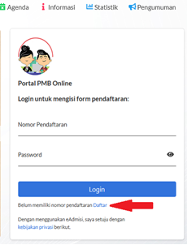
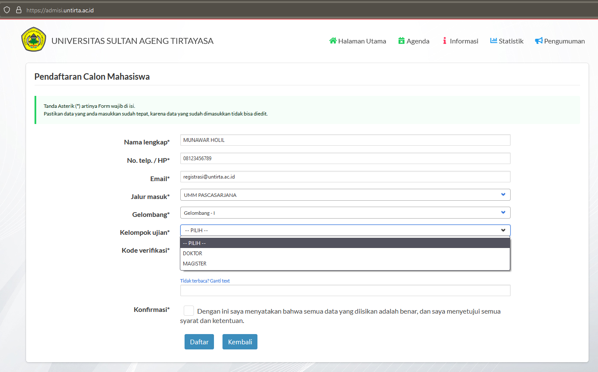

Program Doktor (S3) dan Program Magister (S2) Pascasarjana Universitas Sultan Ageng Tirtayasa (Untirta) berkontribusi dalam pengembangan keilmuan untuk menghasilkan karya-karya ilmiah unggulan dan menghasilkan lulusan Doktor (S3) dan Program Magister (S2) yang kompeten. Pascasarjana Untirta membuka pendaftaran mahasiswa baru Magister (S2) dan Doktor (S3) Tahun Akademik 2023/2024.

### Jadwal Penerimaan Mahasiswa Baru (PMB)

```{=html}
<style type="text/css">
.tg  {border-collapse:collapse;border-spacing:0;}
.tg td{border-color:black;border-style:solid;border-width:1px;font-family:Arial, sans-serif;font-size:14px;
  overflow:hidden;padding:10px 5px;word-break:normal;}
.tg th{border-color:black;border-style:solid;border-width:1px;font-family:Arial, sans-serif;font-size:14px;
  font-weight:normal;overflow:hidden;padding:10px 5px;word-break:normal;}
.tg .tg-1wig{font-weight:bold;text-align:left;vertical-align:top}
.tg .tg-baqh{text-align:center;vertical-align:top}
.tg .tg-2bvl{font-size:20px;font-weight:bold;text-align:center;vertical-align:middle}
.tg .tg-0lax{text-align:left;vertical-align:top}
</style>
<table class="tg">
<thead>
  <tr>
    <th class="tg-2bvl">Kegiatan</th>
    <th class="tg-2bvl">Gelombang 1</th>
    <th class="tg-2bvl">Gelombang 2*</th>
  </tr>
</thead>
<tbody>
  <tr>
    <td class="tg-1wig">Pendaftaran</td>
    <td class="tg-0lax">13 Februari 2023 - 05 April 2023</td>
    <td class="tg-0lax">08 Mei 2023 - 12 Juli 2023</td>
  </tr>
  <tr>
    <td class="tg-1wig">Seleksi Test dan Wawancara</td>
    <td class="tg-0lax">08 April 2023</td>
    <td class="tg-0lax">15 Juli 2023</td>
  </tr>
  <tr>
    <td class="tg-1wig">Pengumuman Hasil Seleksi</td>
    <td class="tg-0lax">13 April 2023</td>
    <td class="tg-0lax">20 Juli 2023</td>
  </tr>
  <tr>
    <td class="tg-1wig">Registrasi / Pembayaran SPP</td>
    <td class="tg-0lax">14 - 28 April 2023</td>
    <td class="tg-0lax">21 - 31 Juli 2023</td>
  </tr>
  <tr>
    <td class="tg-1wig">Matrikulasi</td>
    <td class="tg-baqh" colspan="2">04 - 26 Agustus 2023</td>
  </tr>
  <tr>
    <td class="tg-1wig">Awal Perkuliahan</td>
    <td class="tg-baqh" colspan="2">21 Agustus 2023</td>
  </tr>
</tbody>
</table>
```
\*) *Apabila Kuota Gelombang 1 Belum Terpenuhi*

### Program Studi

**Program Doktor (S3)**

1.  Program Studi Doktor Pendidikan
2.  Program Studi Doktor Ilmu Akuntansi
3.  Program Studi Doktor Ilmu Pertanian

**Program Magister (S2)**

1.  Pendidikan Bahasa Indonesia

2.  Teknologi Pendidikan

    -   *Konsentrasi Manajemen Pendidikan*
    -   *Konsentrasi PAUD*

3.  Hukum

    -   *Konsentrasi Hukum Pidana*
    -   *Konsentrasi Hukum Perdata*
    -   *Konsentrasi Hukum Tata Negara*
    -   *Konsentrasi Hukum Kesehatan*

4.  Administrasi Publik

5.  Akuntansi

6.  Manajemen

    -   *Konsentrasi Manajemen Pemasaran*
    -   *Konsentrasi Manajemen SDM*
    -   *Konsentrasi Manajemen Keuangan*

7.  Pendidikan Bahasa Inggris

8.  Pendidikan Matematika

9.  Ilmu Pertanian

10. Ilmu Komunikasi

11. Teknik Kimia

12. Pendidikan Dasar

13. Ekonomi

14. Teknik Industri dan Manajemen (S2)

15. Studi Lingkungan (S2)

16. Pendidikan Vokasi Keteknikan (S2)

### **Jadwal Pelaksanaan**

| Item              | Waktu                     |
|-------------------|---------------------------|
| Persiapan Seleksi | : pukul 07:00 - 07:30 Wib |
| Sesi 1            | : pukul 07:30 - 09:30 Wib |
| Istirahat         | : pukul 09:30 - 10:00 Wib |
| Sesi 2            | : pukul 10:00 -12:00 Wib  |

### Biaya Perkuliahan

```{=html}
<style type="text/css">
.tg  {border-collapse:collapse;border-spacing:0;}
.tg td{border-color:black;border-style:solid;border-width:1px;font-family:Arial, sans-serif;font-size:14px;
  overflow:hidden;padding:10px 5px;word-break:normal;}
.tg th{border-color:black;border-style:solid;border-width:1px;font-family:Arial, sans-serif;font-size:14px;
  font-weight:normal;overflow:hidden;padding:10px 5px;word-break:normal;}
.tg .tg-2z6x{background-color:#9b9b9b;border-color:inherit;text-align:right;vertical-align:top}
.tg .tg-c3ow{border-color:inherit;text-align:center;vertical-align:top}
.tg .tg-g7sd{border-color:inherit;font-weight:bold;text-align:left;vertical-align:middle}
.tg .tg-7btt{border-color:inherit;font-weight:bold;text-align:center;vertical-align:top}
.tg .tg-0pky{border-color:inherit;text-align:left;vertical-align:top}
.tg .tg-dvpl{border-color:inherit;text-align:right;vertical-align:top}
</style>
<table class="tg">
<thead>
  <tr>
    <th class="tg-g7sd" rowspan="2">Rincian</th>
    <th class="tg-7btt" colspan="2">Biaya</th>
  </tr>
  <tr>
    <th class="tg-7btt">Program Magister (S2)</th>
    <th class="tg-7btt">Program Doktor (S3)</th>
  </tr>
</thead>
<tbody>
  <tr>
    <td class="tg-0pky">Pendaftaran</td>
    <td class="tg-dvpl">Rp500.000,00</td>
    <td class="tg-dvpl">Rp650.000,00</td>
  </tr>
  <tr>
    <td class="tg-0pky">Matrikulasi</td>
    <td class="tg-dvpl">Rp1.000.000,00</td>
    <td class="tg-dvpl">Rp5.000.000,00</td>
  </tr>
  <tr>
    <td class="tg-0pky">SPP/Semester</td>
    <td class="tg-dvpl">Rp8.500.000,00</td>
    <td class="tg-dvpl"><span style="font-weight:bold">Doktor Pendidikan dan Doktor Ilmu Pertanian:</span> Rp11.000.000,00<br><span style="font-weight:bold">Doktor Ilmu Akuntansi</span>: Rp15.000.000,00</td>
  </tr>
  <tr>
    <td class="tg-0pky">Jaket Almamater, KTM,<br>Kartu Perpustakaan</td>
    <td class="tg-c3ow" colspan="2">Rp550.000,00</td>
  </tr>
  <tr>
    <td class="tg-0pky">Intensive English Program</td>
    <td class="tg-dvpl">Rp500.000,00</td>
    <td class="tg-2z6x">-</td>
  </tr>
</tbody>
</table>
```
### Prosedur Pendaftaran

{width="1420"}

1.  Buka laman <https://admisi.untirta.ac.id>

    Klik **Daftar**, masukkan/ketik: Nama Lengkap, No. Telepon/HP, alamat e-mail, pilih jalur masuk Pascasarjana, pilih Gelombang, Pilih Kelompok Ujian MAGISTER atau DOKTOR, dan ketik ulang Kode Verifikasi.

    

    {width="500"}

    > **Klik Daftar untu Mencetak** Surat Konfirmasi Pendaftaran untuk dibawa ke BNI dan melakukan Pembayaran.

    contoh :

    {width="400"}

2.  Melakukan Pembayaran Pendaftaran

    Pembayaran pendaftaran dilakukan untuk mengaktifkan Nomor Pendaftaran (token) dan Password. Untuk Selanjutnya bisa digunakan untuk **Login** ke <https://admisi.untirta.ac.id> dan melengkapi data.

    Pembayaran melalui Bank BNI :

    a.  Teller BNI dengan menunjukkan hasil cetak Surat Konfirmasi Pendaftaran.
    b.  M-Banking BNI dengan cara klik Pembayaran dan memasukkan Kode Biling Nomor Pendaftaran

3.  Unggah Dokumen di laman [**https://admisi.untirta.ac.id**](https://admisi.untirta.ac.id){.uri}

    > **Login** dengan menggunakan Nomor Pendaftaran dan Password yang ada pada Surat Konfirmasi Pendaftaran.

    Dokumen/syarat pendukung dalam bentuk file pdf atau jpg **(maximal 275kb) yang harus disiapkan** :

    A. **PROGRAM MAGISTER (S2)**

    a.  Pas Photo terbaru

    b.  Isi Biodata

    c.  Unggah (*upload*) data pendukung:

        1.  Ijazah S-1, Transkrip Nilai S-1 (Program Magister)

        2.  Sertifikat akreditasi program studi pada jenjang S1 yang berlaku terakhir

        3.  Sertifikat TOEFL dengan skor minimal 400.

        4.  Surat izin/tugas belajar dari instansi tempat bekerja bagi pendaftar yang sedang bekerja

        5.  Surat keterangan sehat dari Fasilitas Kesehatan yang memiliki izin dari pemerintah

        6.  Surat rekomendasi kelayakan akademik dari dua dosen bergelar Doktor atau pimpinan bergelar Doktor.

        7.  Surat Pernyataan Keaslian Dokumen pendaftaran [**(download)**](https://drive.google.com/file/d/1LnpmXVBU5NaSgOFDCaOSGQr2XEhA_UQA/view?usp=sharing).

        8.  Surat Pernyataan kesanggupan pembiayaan pendidikan.

            > **Kumpulan Dokumen** :
            >
            > Unduh, cetak, isi, scan, dan unggah dokumen [**di sini**](https://drive.google.com/file/d/1_uH_GS-4tKLkoZodWsIoB1WCt9ncmbOK/view?usp=sharing){target="_blank"} bagi S2

            <br><br>

    B. **PROGRAM DOKTOR (S3)**

    a.  Pas Photo terbaru

    b.  Isi Biodata

    c.  Unggah (*upload*) data pendukung:

        1.  Ijazah S-1, S-2, Transkrip Nilai S-1, S-2 (Program Doktor)

            > Khusus Program Studi Doktor Ilmu Akuntansi wajib melampirkan Ijazah S1 Akuntansi

        2.  Sertifikat akreditasi program studi pada jenjang S2 yang berlaku terakhir

        3.  Sertifikat TOEFL dengan skor minimal 450.

        4.  Surat izin/tugas belajar dari instansi tempat bekerja bagi pendaftar yang sedang bekerja

        5.  Surat keterangan sehat dari Fasilitas Kesehatan yang memiliki izin dari pemerintah

        6.  Surat rekomendasi kelayakan akademik dari dua Profesor atau Doktor.

        7.  Surat Pernyataan Keaslian Dokumen pendaftaran [**(download)**](https://drive.google.com/file/d/1LnpmXVBU5NaSgOFDCaOSGQr2XEhA_UQA/view?usp=sharing).

        8.  Surat Pernyataan kesanggupan pembiayaan pendidikan.

            > **Kumpulan Dokumen** :
            >
            > Unduh, cetak, isi, scan, dan unggah dokumen [**di sini**](https://drive.google.com/file/d/1_ZoV1c57HOlYCIxCgLE-WJSNpwvRX3Zo/view?usp=sharing){target="_blank"} bagi S3

        9.  Mengunggah Proposal mini Disertasi khusus S3

            > Proposal Mini adalah ide atau gagasan penelitian yang dituangkan dalam bentuk tulisan yang ditulis oleh mahasiswa S-3 Pascasarjana Untirta dengan maksud untuk mengetahui rencana penelitian dan menentukan dosen pembimbing/promotor.
            >
            > **Proposal Mini terdiri dari empat bagian**:
            >
            > a)  Bagian pertama, membahas mengenai latar belakangan pemilihan topik, alasan pemilihan topik, pertanyaan penelitian, tujuan penelitian, dan kebaruan/inovasi penelitian (*state of theart*)
            >
            > b)  Bagian kedua, menjelaskan secara singkat mengenai teori utama dan teori pendukung yang akan digunakan dalam penelitian
            >
            > c)  Bagian ketiga, membahas tentang rencana metode yang akan diterapkan dalam penelitian, termasuk waktu, tempat, dan desain/pendekatan penelitian
            >
            > d)   Bagian keempat, mencantumkan daftar pustaka
            >
            > **Ketentuan Proposal Mini:**
            >
            > a)   Judul yang terdiri dari maksimum 12 kata
            >
            > b)  Tulisan terdiri dari 1500-2000 kata (6 -- 7 lembar)
            >
            > c)  Ditulis menggunakan i, dua spasi, font *Times New Roman*, ukuran font 12 poin, dan ukuran kertas A4
            >
            > d)  Penulisan sitasi dan daftar pustaka menggunakan *reference manager* (*EndNote, Mendeley,* atau program lain)
            >
            > e)  Memuat minimal 15 buah artikel jurnal sebagai rujukan utama yang terbit dalam tujuh tahun terakhir.
            >
            > f)  Secara umum, proposal mini ditulis menggunakan gaya *American Psychology Association* (APA).
            >
            > g)  Disimpan dalam filePDF dengan ukuran maksimal 200 KB.

### Materi Ujian

1.  Tes Kemampuan Dasar Akademik (TKDA) dan Bahasa Inggris

2.  Wawancara

    ### PENGUMUMAN KELULUSAN

    1.  Calon mahasiswa baru dapat melihat Pengumuman Kelulusan melalui web <https://admisi.untirta.ac.id> pada tab Pengumuman, atau bisa cek SK nya di web <https://untirta.ac.id>

        

    2.  EMPAT (4) CARA MEMBAYAR UKT DI UNTIRTA : [**https://link.untirta.ac.id/UKTuntirta**](https://link.untirta.ac.id/UKTuntirta){.uri}

    ### LAIN - LAIN

    **Helpdesk** pendaftaran di Gedung H. Kartiwa Suriasaputra (Pascasarjana), Universitas Sultan Ageng Tirtayasa - Kampus Pakupatan. Telpon; [**0817738817**](https://wa.me/62817738817); [**081911106670**](https://wa.me/6281911106670)**; 08118883616; 08128558538**

Email: [**pmb\@untirta.ac.id**](mailto:pmb@untirta.ac.id) dan [**humas\@untirta.ac.id**](mailto:humas@untirta.ac.id)

Download brosur : [**Brosur Pascasarjana**](https://drive.google.com/file/d/1yuiWmM5BFwm4XSiPlenG2A0TtpBt900I/view?usp=sharing) **- [S3 Akuntansi](https://drive.google.com/file/d/1mgUrcsv7Q9TqKtaXnlHblbEaXXnc41O9/view?usp=sharing) - [S3 Ilmu Pertanian](https://drive.google.com/file/d/1mdnsLflhvdmMcBtWd1xvb_pdUfwJ_SCC/view?usp=sharing) - [S2 Magister Ekonomi](https://drive.google.com/file/d/1pV6OZKa8b2_ah-P0UNgDe9jbk-EiTHWc/view?usp=sharing)**
