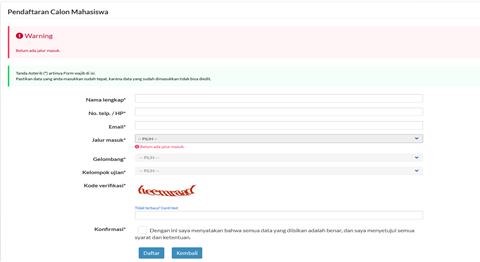

```{=html}
<p align="center"><strong>
PEDOMAN UMUM <br>
UJIAN MASUK MANDIRI PROGRAM DIPLOMA TIGA DAN ALIH JENJANG (S1) (UMM DIPLOMA DAN ALIH JENJANG) <br>
UNIVERSITAS SULTAN AGENG TIRTAYASA <br>
TAHUN AKADEMIK 2023/2024
</strong></p>
```
### **PROGRAM STUDI**

```{=html}
<style type="text/css">
.tg  {border-collapse:collapse;border-spacing:0;}
.tg td{border-color:black;border-style:solid;border-width:1px;font-family:Arial, sans-serif;font-size:14px;
  overflow:hidden;padding:10px 5px;word-break:normal;}
.tg th{border-color:black;border-style:solid;border-width:1px;font-family:Arial, sans-serif;font-size:14px;
  font-weight:normal;overflow:hidden;padding:10px 5px;word-break:normal;}
.tg .tg-zv4m{border-color:#ffffff;text-align:left;vertical-align:top}
</style>
<table class="tg">
<thead>
  <tr>
    <th class="tg-zv4m" rowspan="4">DIPLOMA TIGA EKONOMI</th>
    <th class="tg-zv4m">: D3 Akuntansi</th>
  </tr>
  <tr>
    <th class="tg-zv4m">: D3 Administrasi Pajak</th>
  </tr>
  <tr>
    <th class="tg-zv4m">: D3 Perbankan dan Keuangan</th>
  </tr>
  <tr>
    <th class="tg-zv4m">: D3 Manajemen Pemasaran</th>
  </tr>
</thead>
<tbody>
  <tr>
    <td class="tg-zv4m">DIPLOMA TIGA KEPERAWATAN</td>
    <td class="tg-zv4m">: D3 Keperawatan</td>
  </tr>
  <tr>
    <td class="tg-zv4m" rowspan="2">ALIH JENJANG EKONOMI<br></td>
    <td class="tg-zv4m">: S1 Manajemen</td>
  </tr>
  <tr>
    <td class="tg-zv4m">: S1 Akuntansi</td>
  </tr>
</tbody>
</table>
```
### **PERSYARATAN UMUM PENDAFTARAN**

**DIPLOMA TIGA KEPERAWATAN:**

1.  Lulusan SMA/MA/ Jurusan IPA, SMK Kesehatan/SMK Farmasi/SMK Analis/SMK Kimia, berijazah, 5 (lima) tahun terakhir 2019, 2020, 2021, 2022, dan 2023
2.  Bagi lulusan tahun 2023, telah memiliki Surat Keterangan Lulus yang memuat sekurang-kurangnya informasi jati diri, pas foto yang bersangkutan, serta dibubuhi cap yang sah.
3.  Peserta seleksi dalam kondisi sehat jasmani dan rohani.
4.  Tinggi badan minimum; Perempuan : 150 cm Laki-laki : 155 cm
5.  Tidak buta warna, parsial maupun total.
6.  Pemeriksaan Kesehatan langsung di Lokasi Universitas Sultan Ageng Tirtayasa

**DIPLOMA TIGA EKONOMI:**

1.  Lulusan SMA/MA/SMK/atau sederajat dan Paket C, berijazah, 5 (lima) tahun terakhir 2019, 2020, 2021, 2022, dan 2023
2.  Bagi lulusan Paket C, usia maksimum saat pendaftaran adalah 22 tahun
3.  Bagi lulusan tahun 2023, telah memiliki Surat Keterangan Lulus yang memuat sekurang-kurangnya informasi jati diri, pas foto yang bersangkutan, serta dibubuhi cap yang sah.
4.  Peserta seleksi dalam kondisi sehat jasmani dan rohani.
5.  Bebas Narkoba dari Rumah Sakit Pemerintah / BNN

**ALIH JENJANG EKONOMI:**

Mahasiswa baru jalur **alih jenjang** adalah migrasi mahasiswa lulusan D3 dari Perguruan Tinggi asal /lain melalui proses administrasi dan konversi nilai mata kuliah yang sudah ditempuh di Perguruan Tinggi asal.

1.  Lulusan PTN, angkatan lima tahun terakhir.
2.  Ijazah D3 dan Transkrip Minimal IPK 2,75.
3.  Pilihan Program Studi harus Linier.
4.  Akreditasi BAN PT Asal D3 dari PTN lain, minimal B (baik).
5.  Biaya konversi setelah diterima adalah Rp 1.000.000,-
6.  Peserta seleksi dalam kondisi sehat jasmani dan rohani.
7.  Bebas Narkoba dari Rumah Sakit Pemerintah / BNN

### KUOTA PENERIMAAN

```{=html}
<style type="text/css">
.tg  {border-collapse:collapse;border-spacing:0;}
.tg td{border-color:black;border-style:solid;border-width:1px;font-family:Arial, sans-serif;font-size:14px;
  overflow:hidden;padding:10px 5px;word-break:normal;}
.tg th{border-color:black;border-style:solid;border-width:1px;font-family:Arial, sans-serif;font-size:14px;
  font-weight:normal;overflow:hidden;padding:10px 5px;word-break:normal;}
.tg .tg-baqh{text-align:center;vertical-align:top}
.tg .tg-amwm{font-weight:bold;text-align:center;vertical-align:top}
.tg .tg-0lax{text-align:left;vertical-align:top}
</style>
<table class="tg">
<thead>
  <tr>
    <th class="tg-amwm">PROGRAM STUDI</th>
    <th class="tg-amwm">KUOTA AWAL</th>
    <th class="tg-amwm">SNBP</th>
    <th class="tg-amwm">SNBT</th>
    <th class="tg-amwm">KUOTA MANDIRI</th>
  </tr>
</thead>
<tbody>
  <tr>
    <td class="tg-0lax">AKUNTANSI</td>
    <td class="tg-baqh">90</td>
    <td class="tg-baqh">14</td>
    <td class="tg-baqh">42</td>
    <td class="tg-baqh">34</td>
  </tr>
  <tr>
    <td class="tg-0lax">MANJEMEN PEMASARAN</td>
    <td class="tg-baqh">90</td>
    <td class="tg-baqh">16</td>
    <td class="tg-baqh">43</td>
    <td class="tg-baqh">31</td>
  </tr>
  <tr>
    <td class="tg-0lax">ADMINISTRASI PAJAK</td>
    <td class="tg-baqh">90</td>
    <td class="tg-baqh">19</td>
    <td class="tg-baqh">45</td>
    <td class="tg-baqh">26</td>
  </tr>
  <tr>
    <td class="tg-0lax">PERBANKAN DAN KEUANGAN</td>
    <td class="tg-baqh">90</td>
    <td class="tg-baqh">17</td>
    <td class="tg-baqh">45</td>
    <td class="tg-baqh">28</td>
  </tr>
  <tr>
    <td class="tg-0lax">KEPERAWATAN</td>
    <td class="tg-baqh">70</td>
    <td class="tg-baqh">16</td>
    <td class="tg-baqh">21</td>
    <td class="tg-baqh">33</td>
  </tr>
  <tr>
    <td class="tg-amwm">TOTAL</td>
    <td class="tg-amwm">430</td>
    <td class="tg-amwm">82</td>
    <td class="tg-amwm">196</td>
    <td class="tg-amwm">152</td>
  </tr>
</tbody>
</table>
```

### **JADWAL PELAKSANAAN**

| **Keterangan**          | Waktu Pelaksanaan                               |
|--------------------------|---------------------------------------------|
| Pendaftaran             | 22 Mei - 28 Juli 2023 (ditutup pukul 16:30 WIB) |
| Ujian Masuk             | 30 Juli 2023                                    |
| Pengumuman Hasil Ujian  | 31 Juli 2023 ~~01 Agustus 2023~~                |
| Pembayaran UKT dan BPIN | 03 - 12 Agustus 2023git                         |

### **MATERI UJIAN**

|              |                                          |
|--------------|------------------------------------------|
| EKONOMI      | : Tes Potensi Skolastik (TPS)            |
|              | : Tes Kemampuan Akademik Soshum (TKS)    |
| KEPERAWATAN  | : Tes Potensi Skolastik (TPS)            |
|              | : Tes Kemampuan Akademik Saintek (TKS)   |
| ALIH JENJANG | : Tes Potensi Skolastik (TPS)            |
|              | : Tes Kemampuan Akademik Keilmuan (TKAK) |

**BIAYA PENDAFTARAN**

Pembayaran dilakukan melalui Bank BNI (seluruh cabang)

Diploma Tiga dan Alih Jenjang Ekonomi : Rp 400.000,-

Diploma Tiga Keperawatan : Rp 550.000,-

Membayar Iuran Pengembangan Institusi Negara (IPIN), jika dinyatakan Lulus;

-   Diploma Tiga Ekonomi : Rp 5.000.000

-   Diploma Tiga Keperawatan : Rp 10.000.000

-   Alih Jenjang Ekonomi Fakultas Ekonomi dan Bisnis : Rp 10.000.000

Biaya konversi setelah diterima : Rp 1.000.000,-

### **BIAYA PENDIDIKAN**

1.  Biaya Uang Kuliah Tunggal (UKT) sesuai dengan Keputusan Rektor Nomor: 379/UN43/KP.TM.01.03/2020 tentang Penetapan Biaya Pendaftaran, Uang Kuliah Tunggal, dan Iuran Pembangunan Institusi Bagi Mahasiswa Baru Program Sarjana Jalur Seleksi Mandiri Masuk Perguruan Tinggi Negeri Wilayah Barat Universitas Sultan Ageng Tirtayasa Tahun Akademik 2022/2023, yaitu:

| No  | Kode | Program Studi         | K3          | K4          | K5          | K6          |
|:----------|:----------|:----------|:----------|:----------|:----------|:----------|
| 1\. | 5501 | Akuntansi             | 3.000.000,- | 4.000.000,- | 5.500.000,- | \-          |
| 2\. | 5502 | Manajemen Pemasaran   | 3.000.000,- | 4.000.000,- | 5.500.000,- | \-          |
| 3\. | 5503 | Perpajakan            | 3.000.000,- | 4.000.000,- | 5.500.000,- | \-          |
| 4\. | 5504 | Perbankan dan Keungan | 3.000.000,- | 4.000.000,- | 5.500.000,- | \-          |
| 5\. | 8801 | Keperawatan           | 6.000.000,- | 6.500.000,- | 7.000.000,- | \-          |
| 6\. | 5551 | Manajemen (S1)        | 3.000.000,- | 4.500.000,- | 6.000.000,- | \-          |
| 7\. | 5552 | Akuntansi (S1)        | 3.000.000,- | 5.000.000,- | 6.500.000,- | 7.500.000,- |

2.  **Biaya yang harus dibayar di awal semester I = Biaya IPIN + UKT.** Untuk semester selanjutnya yang dibayar hanya UKT.<br>

    

**TATA CARA PENDAFTARAN**

```{=html}
<p>Pendaftaran <em>online</em> dilakukan mulai: <br>
<strong>22 Mei – 28 Juli 2023, pukul 16.30 WIB </strong><br>
<strong></strong>
</p>
```
1.  Buka laman [**https://admisi.untirta.ac.id**](https://admisi.untirta.ac.id)**, Klik Daftar** pada tanda yang ditunjuk panah merah.

    

2.  Masukan data yang diminta dan pilihan program studi yang diinginkan. Pastikan data diisi dengan benar (no.HP/email) karena semua data akan mejadi acuan panitia dalam berkomunikasi atu mengirim notifikasi. Satu email hanya bisa dipakai untuk mendaftar satu kali.  

3.  Setelah memasukan kode verifikasi dan ceklis konfirmasi kemudian klik **Daftar**.

    

    > *Peserta Program studi **Diploma Tiga Ekonomi**, dapat memilih maksimal **dua program studi**, sedangkan peserta **Ahli Jenjang (S1)**, hanya diperbolehkan memilih **satu** jurusan, sesuai dengan linieritas ijazah diplomanya.*

    > *Peserta yang berminat memilih **Diploma Tiga Keperawatan** hanya satu pilihan.*

4.  **Cetak Bukti Pendaftaran** dan tunjukan ke petugas Teler Bank untuk pembayaran, atau bisa melakukan pembayaran dengan salah satu fasilitas Bank cek [**di sini**](https://drive.google.com/file/d/1IIaFh62Irl6cK4EpdaTqcwOk3OMfmH8t/view?usp=sharing)

    contoh :

    {width="300"}

    > **Nomor Pendaftaran** = Nomor Rekening/Nomor Tagihan.
    >
    > Pembayaran pendaftaran dilakukan untuk mengaktifkan Nomor Pendaftaran (token) dan Password. Untuk Selanjutnya bisa digunakan untuk **Login** ke [**https://admisi.untirta.ac.id**](https://admisi.untirta.ac.id/) dan melengkapi data.

5.  Setelah melakukan pembayaran, buka kembali laman [**https://admisi.untirta.ac.id**](https://admisi.untirta.ac.id) kemudian pendaftar melakukan **Login,** dengan menggunakan Nomor Pendaftaran dan Password yang ada pada Bukti Pendaftaran.

6.  **Lengkapi Data dengan Benar dan Jujur,** berikut dokumen yang harus dilengkapi :

    1.  File Pasfoto berwarna terbaru (standar untuk ijazah) dengan wajah menghadap ke depan, ukuran 4x6 cm, **berformat \*jpg**, dengan resolusi maksimum 300pxl x 450pxl, dan ukuran file maksimum 200 kb.

    2.  [**Pakta Integritas Mahasiswa**](https://drive.google.com/file/d/1WaDDgIUe78UIx3qvsbHVWLGfgHUWplyt/view?usp=share_link) (*download*, cetak, isi, *scan*, dan *upload*).

    3.  [**Surat Pernyataan Mematuhi Peraturan dan Kesanggupan Membayar Biaya Pendidikan**](https://drive.google.com/file/d/1W_K_8IGQ_xwtaJ3eqGnno7K0ro5Vexdo/view?usp=share_link)(*download*, cetak, isi, *scan*, dan *upload*).

    4.  Ijazah / Surat Keterangan Lulus bagi lulusan tahun 2023 yang belum memperoleh Ijazah. **atau Surat Keterangan Kelas XII atau Kartu Peserta Ujian Sekolah** (scan, upload)

    5.  Akta Kelahiran (*scan* dan *upload*).

    6.  Kartu Keluarga (*scan* dan *upload*).

    7.  Bukti pembayaran listrik bagi pelanggang *pascabayar* **atau** bukti pembelian token listrik bagi pelanggan *prabayar* (*scan* dan *upload*).

    8.  Pilih **salah satu** yang paling sesuai.

        -   SPPT Pajak Bumi dan Bangunan (PBB) tiga tahun terakhir (pilih salah satu)
        -   [**Surat Pernyataan tentang Luas Tanah dan Bangunan Rumah yang ditempati**](https://drive.google.com/file/d/1WrHzSj8ulBG2VrpmJ-ssthPfUbBl0QqL/view?usp=share_link) bagi yang tidak punya SPPT
        -   Jika Rumah Mengontrak dan tidak ada Bukti PBB lampirkan Bukti pembayaran sewa rumah bagi yang mengontrak/sewa ditambah [**Surat Pernyataan tentang Luas Tanah dan Bangunan Rumah yang ditempati**](https://drive.google.com/file/d/1WqMwvIShVGleoOzbJl6XGKKAxJDGYaRy/view?usp=share_link)

    9.  **Untuk Kelompok Ujian Ekonomi dan Alih Jenjang (S1) Wajib Upload** Surat Keterangan Sehat, Surat Hasil Test Narkoba dari Rumah Sakit Pemerintah / BNN.

        > Untuk Kelompok Ujian Keperawatan akan melakukan tes kesehatan di lokasi Tes sesuai jadwal.

    10. Bukti Penghasilan Ayah dan Penghasilan Ibu dengan ketentuan sebagai berikut (*scan* dan *upload*):

        -   **PNS**/**TNI**/**BUMN**/**Karyawan Swasta** : Slip Gaji / Bukti Penghasilan maksimal 2 (dua) bulan terakhir **tahun 2023 (terbaru)**,

        -   **Wiraswasta**/**Petani**/**Pedagang**/**Buruh**/**Tidak Mempunyai Pekerjaan Tetap** : Surat Keterangan Penghasilan dari Kelurahan dengan wajib mencantumkan **(1) NAMA PEKERJAAN (2) NOMINAL PENGHASILAN/bulan** (*scan* dan *upload*),

        -   **Pensiunan** : Rekening Koran atau *print out* Buku Rekening Pensiun maksimal 2 (dua) bulan terakhir **tahun 2023 (terbaru)**.

            > ***Jika Ayah sudah meninggal** kolom penghasilan di isi nol. Dokumen yang di upload Surat Kematian.*
            >
            > **Jika Ibu ibu Rumah Tangga** minta surat keterangan dari RW/Kelurahan
            >
            > *Penghasilan Ayah dan Ibu di isi dengan data sebenarnya dan **tidak boleh 0 (nol) semua**.*

    > **Pertanyaan / Isian yang bertanda bintang (\*) wajib di isi**, sedangkan untuk pertanyaan yang tidak ada tanda bintang bisa di isi jika anda mempunyai datanya atau boleh dikosongkan.<br>

## Jadwal Ujian Tulis Berbasis Komputer (UTBK)

```{=html}
<style type="text/css">
.tg  {border-collapse:collapse;border-spacing:0;}
.tg td{border-color:black;border-style:solid;border-width:1px;font-family:Arial, sans-serif;font-size:14px;
  overflow:hidden;padding:10px 5px;word-break:normal;}
.tg th{border-color:black;border-style:solid;border-width:1px;font-family:Arial, sans-serif;font-size:14px;
  font-weight:normal;overflow:hidden;padding:10px 5px;word-break:normal;}
.tg .tg-9wq8{border-color:inherit;text-align:center;vertical-align:middle}
.tg .tg-baqh{text-align:center;vertical-align:top}
.tg .tg-c3ow{border-color:inherit;text-align:center;vertical-align:top}
.tg .tg-7btt{border-color:inherit;font-weight:bold;text-align:center;vertical-align:top}
.tg .tg-0pky{border-color:inherit;text-align:left;vertical-align:top}
.tg .tg-uzvj{border-color:inherit;font-weight:bold;text-align:center;vertical-align:middle}
.tg .tg-0lax{text-align:left;vertical-align:top}
</style>
<table class="tg">
<thead>
  <tr>
    <th class="tg-7btt">Hari dan Tanggal</th>
    <th class="tg-7btt">Kegiatan</th>
    <th class="tg-7btt">Waktu (WIB)</th>
    <th class="tg-7btt">Kelompok ujian<br></th>
  </tr>
</thead>
<tbody>
  <tr>
    <td class="tg-9wq8" rowspan="5"><span style="font-weight:bold"> SESI I </span><br>Minggu, 30 Juli 2023</td>
    <td class="tg-0pky">Peserta masuk ruang ujian</td>
    <td class="tg-c3ow">07.30 - 07.45</td>
    <td class="tg-9wq8" rowspan="5">Ekonomi dan Keperawatan</td>
  </tr>
  <tr>
    <td class="tg-0pky">Pemeriksaan identitas dan dokumen</td>
    <td class="tg-c3ow">07.45 - 07.55</td>
  </tr>
  <tr>
    <td class="tg-0pky">Latihan</td>
    <td class="tg-c3ow">07.55 - 08.00</td>
  </tr>
  <tr>
    <td class="tg-0pky">Tes Potensi Skolastik (TPS)</td>
    <td class="tg-c3ow">08.00 - 08.30</td>
  </tr>
  <tr>
    <td class="tg-0pky">Tes Kemampuan Akademik (TKA) Saintek/Soshum</td>
    <td class="tg-c3ow">08.30 - 09.00</td>
  </tr>
  <tr>
    <td class="tg-uzvj" rowspan="5"><span style="font-weight:bold"> SESI II </span><br>Minggu, 30 Juli 2023</td>
    <td class="tg-0pky">Peserta masuk ruang ujian</td>
    <td class="tg-c3ow">10.30 - 10.45</td>
    <td class="tg-9wq8" rowspan="5">Ekonomi dan Keperawatan<br></td>
  </tr>
  <tr>
    <td class="tg-0lax">Pemeriksaan identitas dan dokumen</td>
    <td class="tg-baqh">10.45 - 10.55</td>
  </tr>
  <tr>
    <td class="tg-0lax">Latihan</td>
    <td class="tg-baqh">10.55 - 11.00</td>
  </tr>
  <tr>
    <td class="tg-0lax">Tes Potensi Skolastik (TPS)</td>
    <td class="tg-baqh">11.00 - 11.30</td>
  </tr>
  <tr>
    <td class="tg-0lax">Tes Kemampuan Akademik (TKA) Saintek/Soshum</td>
    <td class="tg-baqh">11.30 - 12.00</td>
  </tr>
  <tr>
    <td class="tg-0lax" colspan="2">Tes Kesehatan Khusus Keperawatan (Kampus Kepandean)<br></td>
    <td class="tg-baqh">13.00 -&nbsp;&nbsp;Selesai</td>
    <td class="tg-baqh" rowspan="5">Keperawatan<br></td>
  </tr>
</tbody>
</table>
```
> Peserta wajib hadir di lokasi ujian, 60 menit sebelum ujian dilaksanakan.

### TATA TERTIB UTBK

Berikut Tata Tertib pada saat pelaksanaan Ujian Tulis Berbasis Komputer untuk Diploma Tiga dan Alih Jenjang. [**https://link.untirta.ac.id/TATATERTIB**](https://link.untirta.ac.id/TATATERTIB)

### PENGUMUMAN KELULUSAN

1.  Calon mahasiswa baru dapat melihat Pengumuman Kelulusan melalui web <https://admisi.untirta.ac.id> pada tab Pengumuman, atau bisa cek SK nya di web <https://untirta.ac.id>


2.  Besaran UKT dapat dilihat dengan cara lgin kembali menggunakan nomor pendaftaran dan password saat pendaftaran, sesuai jadwal pembayaran.

3.  EMPAT (4) CARA MEMBAYAR UKT DI UNTIRTA MELALUI BANK BNI : [**https://link.untirta.ac.id/UKTuntirta**](https://link.untirta.ac.id/UKTuntirta){.uri}

### **LAIN - LAIN**

**Helpdesk** pendaftaran di Gedung Pusdainfo Lantai 1, Universitas Sultan Ageng Tirtayasa. Telpon; [**0817738817**](https://wa.me/62817738817); [**081911106670**](https://wa.me/6281911106670)

**Hotline Registrasi/Admisi** : [https://wa.me/**6281311734542**](https://wa.me/6281311734542)

Email: [**pmb\@untirta.ac.id**](mailto:pmb@untirta.ac.id) dan [**humas\@untirta.ac.id**](mailto:humas@untirta.ac.id)

### Ketentuan Khusus

1.  Calon mahasiswa baru yang tidak dapat memenuhi persyaratan registrasi administrasi sebagaimana yang ditetapkan dinyatakan **GUGUR**.
2.  Biaya UKT dan IPIn yang telah dibayarkan sesuai dengan besaran yang telah ditetapkan, tidak dapat dikembalikan sesuai dengan Pakta Integritas yang sudah disetujui diatas materai.
3.  [**Link Grup Peserta Tes D3 dan Alih Jenjang**](https://chat.whatsapp.com/HD6BaxuYjRkBqvFHmQUaQF) untuk memperoleh informasi terbaru.
